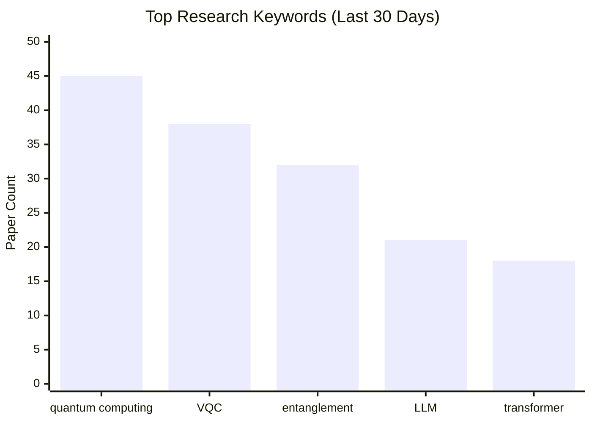

<div align="center">

# 🔬 ArXiv Daily Researcher

**基于 LLM 的智能学术论文监控、筛选与深度分析系统**

[](#-更新日志)
[](https://www.gnu.org/licenses/agpl-3.0)
[](https://www.python.org/downloads/)
[](https://www.docker.com/)
[](https://github.com/features/actions)
[](#-streamlit-配置面板)

*每天早上打开通知，高质量论文摘要已经为你准备好；一行命令，纵览一年研究趋势。*

</div>

---

自动从 **ArXiv** 与 **20+ 顶级学术期刊**获取最新论文，通过可配置的关键词权重评分系统精准筛选相关论文，下载 PDF 进行深度分析，追踪关键词演变趋势，生成专业报告，并推送多渠道通知——**全程自动化，零人工干预**。

---

## ✨ 核心功能

<table>
<tr>
<td colspan="2" align="center">
<sub>— 数据获取 &amp; 智能筛选 —</sub>
</td>
</tr>
<tr>
<td width="50%" valign="top">

### 📡 多数据源支持

从 ArXiv 预印本和 **20+ 顶级期刊**（PRL、Nature、Science 等）同步抓取。期刊论文自动检测 ArXiv 版本并切换来源，规避版权限制，获取完整摘要与可下载 PDF。可选接入 **Semantic Scholar** 获取引用数和 AI 单句摘要。

</td>
<td width="50%" valign="top">

### 🎯 双 LLM 加权评分

CHEAP_LLM 对每篇论文的每个关键词独立评分（0–10），乘以权重求和后与**动态及格线**比较。支持从参考 PDF **自动提取关键词**并分配层级权重，支持**专家作者加分**。

</td>
</tr>
<tr>
<td colspan="2" align="center">
<sub>— 深度分析 &amp; 知识积累 —</sub>
</td>
</tr>
<tr>
<td width="50%" valign="top">

### 🔍 深度 PDF 分析

通过筛选的论文自动下载 PDF，SMART_LLM 提取**研究方法、创新点、技术栈、关键结论、局限性、研究关联、未来方向**七个维度。支持 **MinerU 云端**与 **PyMuPDF 本地**双模式解析，可自动降级。摘要自动中文翻译（MD5 缓存去重）。

</td>
<td width="50%" valign="top">

### 📈 关键词趋势追踪

每篇论文关键词写入 SQLite，通过 AI 批量语义归并（如 `"QC"` → `"Quantum Computing"`），生成 Mermaid 柱状图和折线趋势图。HTML 报告含 **CSS 彩色水平柱状图 + 趋势热图**，每个关键词贯穿所有视图共享一种颜色。

</td>
</tr>
<tr>
<td colspan="2" align="center">
<sub>— 趋势研究 &amp; 成本监控 —</sub>
</td>
</tr>
<tr>
<td width="50%" valign="top">

### 🔬 研究趋势分析 <sup><kbd>v3.0</kbd></sup>

全新独立运行模式：指定关键词与任意时间范围（可过滤 ArXiv 分类），批量检索 ArXiv 论文，LLM 逐篇生成 TLDR，SMART_LLM **单次调用**综合分析五个维度（热点话题、时间演变、核心研究者、研究空白、方法论趋势），大幅降低 Token 消耗。

</td>
<td width="50%" valign="top">

### 📊 Token 消耗追踪 <sup><kbd>v3.0</kbd></sup>

线程安全全局计数器，实时统计每次运行所有 LLM 调用的 Token 消耗，按模型分类展示在**报告末尾**和**所有通知渠道**中。可一键开关，不影响其他功能。

</td>
</tr>
<tr>
<td colspan="2" align="center">
<sub>— 报告输出 &amp; 通知推送 —</sub>
</td>
</tr>
<tr>
<td width="50%" valign="top">

### 📄 Markdown + HTML 双格式报告

按数据源 / 关键词独立输出报告。三种报告类型：**每日研究**、**研究趋势**、**关键词趋势**。Markdown 含可折叠详情块，HTML 卡片式响应式布局。样式通过外置 **CSS 变量**完全可自定义。

</td>
<td width="50%" valign="top">

### 🔔 六渠道通知推送

**邮件**（HTML 精美模板）、**企业微信**、**钉钉**（支持签名验证）、**Telegram**、**Slack**、**自定义 Webhook**。各渠道**独立开关**，模板均可自定义。错误（MinerU 过期、LLM 异常等）实时告警。

</td>
</tr>
<tr>
<td colspan="2" align="center">
<sub>— 配置管理 &amp; 部署运维 —</sub>
</td>
</tr>
<tr>
<td width="50%" valign="top">

### 🧙 交互式配置向导 <sup><kbd>v3.0</kbd></sup>

7 步 CLI 向导，逐步引导完成 LLM、搜索、数据源、关键词、评分、通知、高级选项的全部配置。已有配置的字段可直接回车跳过，必填字段（如 API Key）未配置时强制要求输入。**Docker 首次部署自动触发**，支持 LLM 连接测试，自动生成 `.env` 和 `config.json`。

</td>
<td width="50%" valign="top">

### 🖥️ Streamlit 管理面板 <sup><kbd>v3.0</kbd></sup>

浏览器 7-Tab 可视化编辑所有配置 + 在线预览 HTML 报告，支持 LLM 连接测试、SMTP 测试、评分预览。独立 Docker 镜像（`Dockerfile.webui`），256 MB 内存即可运行。

</td>
</tr>
<tr>
<td width="50%" valign="top">

### 🚀 三种部署方式

**本地脚本 + Cron**、**Docker 容器**（内置定时任务，512 MB 即可运行）、**GitHub Actions**（无需服务器，每日运行 + 手动趋势分析工作流，报告保存为 Artifact）——三平台运行脚本开箱即用。

</td>
<td width="50%" valign="top">

### 🛡️ 生产级可靠性 <sup><kbd>v3.0</kbd></sup>

全链路**指数退避重试**、MinerU **智能降级**、翻译 **MD5 缓存**去重、**线程安全**并发。<br>**fcntl 文件锁**防止 daily / trend 双模式重复并发运行（按参数哈希独立互锁）。**日志轮转**、GitHub **自动更新**——开箱即可长期无人值守运行。

</td>
</tr>
</table>

---

## 📑 导航目录

<table>
<tr>
<td width="50%" valign="top">

<h4>📘 快速上手</h4>

|       | 章节                     | 简介                           |
| :---: | :----------------------- | :----------------------------- |
|  01   | [✨ 核心功能](#-核心功能) | 12 大功能模块一览              |
|  02   | [🚀 快速开始](#-快速开始) | 三步完成部署与首次运行         |
|  03   | [🛠️ 配置工具](#️-配置工具) | CLI 向导 + Streamlit Web UI    |
|  04   | [🐳 部署方式](#-部署方式) | Docker / GitHub Actions / 本地 |

</td>
<td width="50%" valign="top">

<h4>📗 深入了解</h4>

|       | 章节                     | 简介                                 |
| :---: | :----------------------- | :----------------------------------- |
|  05   | [📖 功能详解](#-功能详解) | 运行模式 · 各功能模块 · 完整配置参考 |
|  06   | [📁 项目结构](#-项目结构) | 源码目录全览                         |
|  07   | [❓ 常见问题](#-常见问题) | 疑难排查与进阶 Q&A                   |
|  08   | [📝 更新日志](#-更新日志) | 各版本变更详情                       |

</td>
</tr>
</table>

---

## 🚀 快速开始

### 第一步：克隆与安装

```bash
git clone https://github.com/yzr278892/arxiv-daily-researcher.git
cd arxiv-daily-researcher
python -m venv venv && source venv/bin/activate   # Windows: venv\Scripts\activate
pip install -r requirements.txt
```

### 第二步：完成配置

推荐使用交互式配置向导——7 步引导完成所有必要配置（LLM API Key、研究关键词、通知渠道等）：

```bash
python src/utils/setup_wizard.py
```

向导结束后自动生成 `.env` 和 `configs/config.json`，**直接进入第三步**。

> [!TIP]
> 已有配置文件时，向导会预填入现有值，只需修改需要变更的项，按 Enter 保留其余不变。

<details>
<summary><b>手动配置（跳过向导）</b></summary>

**1. 复制模板并填写 LLM API Key：**

```bash
cp .env.example .env
```

```env
# 低成本 LLM — 评分、翻译、TLDR、关键词标准化（如 deepseek-chat、gpt-4o-mini）
CHEAP_LLM__API_KEY=sk-your-key
CHEAP_LLM__BASE_URL=https://api.openai.com/v1
CHEAP_LLM__MODEL_NAME=gpt-4o-mini

# 高性能 LLM — 深度 PDF 全文分析、趋势综合分析（如 gpt-4o、claude-3-opus）
SMART_LLM__API_KEY=sk-your-key
SMART_LLM__BASE_URL=https://api.openai.com/v1
SMART_LLM__MODEL_NAME=gpt-4o
```

**2. 编辑 `configs/config.json`，填写研究关键词和领域：**

```jsonc
{
  "keywords": {
    "primary_keywords": {
      "weight": 1.0,
      "keywords": ["quantum error correction", "surface code"]
    },
    "research_context": "我的研究方向是容错量子计算与量子纠错码"
  },
  "target_domains": { "domains": ["quant-ph"] }
}
```

> [!TIP]
> 两个 LLM 可配置同一 Key 和模型（如 `deepseek-chat`），兼顾经济性与质量。完整可选项（OpenAlex、MinerU、通知渠道等）见 `.env.example`。

</details>

### 第三步：运行

```bash
# 每日研究模式（默认）—— 抓取最新论文 · 评分筛选 · PDF 深度分析
python main.py

# 研究趋势分析模式 —— 指定关键词检索任意时间段的 ArXiv 论文并生成趋势报告
python main.py --mode trend_research --keywords "quantum error correction"
```

报告输出至 `data/reports/`，日志保存在 `logs/`。

---

## 🛠️ 配置工具

本系统提供两种配置方式，适用于不同场景：

### 🧙 交互式配置向导 <sup><kbd>v3.0</kbd></sup>

首次部署推荐使用，逐步引导完成所有配置：

```bash
python src/utils/setup_wizard.py
```

| 步骤  | 内容                 | 说明                                                                                         |
| :---: | :------------------- | :------------------------------------------------------------------------------------------- |
|   1   | **LLM 配置**（必填） | 选择 Provider（OpenAI / DeepSeek / Ollama / 智谱 / 自定义），自动填入 Base URL，可选连接测试 |
|   2   | 搜索设置             | 搜索天数、每源最大结果数                                                                     |
|   3   | 数据源               | 勾选需要监控的数据源（ArXiv + 20 种顶级期刊）和 ArXiv 分类                                   |
|   4   | 关键词               | 设置研究关键词、权重、参考 PDF 自动提取、研究背景描述                                        |
|   5   | 评分                 | 通过分基础分、权重系数、作者加分                                                             |
|   6   | 通知                 | 渠道选择（Email / 企微 / 钉钉 / Telegram / Slack / Webhook）+ 凭据填写                       |
|   7   | 高级（可跳过）       | PDF 解析、并发、日志保留                                                                     |

完成后自动生成 `.env` 和 `configs/config.json`，写前自动备份原文件（`.bak`）。

---

### 🖥️ Streamlit 配置面板 <sup><kbd>v3.0</kbd></sup>

**启动方式：**

```bash
# 本地运行（需已安装依赖）
streamlit run src/webui/config_panel.py
# 浏览器访问 http://localhost:8501
```

```bash
# Docker 运行（独立 WebUI 容器）
docker compose -f docker/docker-compose.yml --profile webui up -d config-panel
# 浏览器访问 http://localhost:8501
```

配置面板通过读写挂载的 `configs/` 和 `.env` 与主程序共用同一套配置文件，修改立即生效（主程序下次运行时读取）。

**7 个 Tab 页详解：**

| Tab            | 配置内容                                                                                                                                               |
| :------------- | :----------------------------------------------------------------------------------------------------------------------------------------------------- |
| **LLM**        | CHEAP_LLM / SMART_LLM 的 API Key（遮蔽显示）、接口地址、模型名称、温度；支持**一键连接测试**                                                           |
| **搜索**       | 搜索天数、单源最大抓取数、按来源单独限制数量；ArXiv 领域分类多选、数据源启用（ArXiv + 20 种期刊）                                                      |
| **关键词**     | 主关键词列表（多行文本框）、全组权重；参考 PDF 提取开关、最大关键词数、相似度阈值、三档权重分布；研究背景描述                                          |
| **评分**       | 及格线公式（基础分 + 权重系数）、每关键词最高分；专家作者列表及加分；不及格论文是否入报告；**实时评分预览**                                            |
| **通知**       | 全局通知开关；成功/失败/附件独立开关；**6 个渠道**（Email / 企业微信 / 钉钉 / Telegram / Slack / 通用 Webhook）各自的启用开关和凭据；**SMTP 连接测试** |
| **高级**       | PDF 解析模式（MinerU / PyMuPDF）+ MinerU 模型版本；并发开关及线程数；HTML 报告开关；日志轮转方式（时间 / 大小）及保留天数；自动更新开关                |
| **报告查看** <sup><kbd>v3.0</kbd></sup> | 三列并排展示全部类型报告（每日研究 / 趋势分析 / 关键词趋势），每列按来源 / 关键词 Slug 分组，日期标签自动格式化；点击「▶ 预览」后页内嵌入渲染 HTML（高度可调 600–2000 px）；趋势报告显示运行参数摘要（关键词、日期范围、论文数量） |

**侧边栏功能：**

- **Save All Changes** — 一键将 6 个配置 Tab 的修改写回 `.env` 和 `config.json`（写前自动备份 `.bak`）
- **Reload Config** — 重新从文件加载，丢弃未保存的修改
- 配置文件存在状态指示（`.env` / `config.json` 是否已创建）
- 语言切换：**中文 ↔ English**（`src/webui/i18n.py` 实现双语翻译）

> [!NOTE]
> WebUI 容器使用独立的 `profiles: [webui]`，不影响主研究容器。只有显式指定 `--profile webui` 时才会启动，两者相互独立。

### 🪶 简洁版 WebUI（日志 + HTML 查看）

为降低浏览器内存占用，新增了独立轻量页面：仅查看日志和 HTML，不包含任何配置编辑项。

```bash
# Docker 启动简洁版 WebUI（端口 8502）
docker compose -f docker/docker-compose.yml --profile webui up -d simple-viewer
# 浏览器访问 http://localhost:8502
```

页面能力：
- 按日期查看日志文件
- 展示 ArXiv 过滤前/后统计曲线（`raw_total` / `date_filtered` / `kept`）
- 查看被日期过滤论文详情（来自日志中的 `FilteredByDate`）
- 按日期查看 HTML 文件，默认源码预览（低内存），可手动切换渲染预览


<details>
<summary><b>配置向导 vs 配置面板，该用哪个？</b></summary>

| 工具                             | 适用场景                          | 特点                                      |
| :------------------------------- | :-------------------------------- | :---------------------------------------- |
| **配置向导** (`setup_wizard.py`) | 首次部署、无头服务器、SSH 环境    | CLI 终端交互，无需浏览器，支持连接测试    |
| **配置面板** (`config_panel.py`) | 日常调整、Docker 环境、可视化操作 | 浏览器 UI，7 Tab 页，所见即所得，一键保存，内置报告查看 |

**建议**：首次安装时用向导完成基础配置；后续调整参数时打开配置面板更直观高效。

</details>

---

## 🐳 部署方式

### Docker 部署

适合长期后台运行，容器内置 cron 定时任务，**三步启动**：

```bash
git clone https://github.com/yzr278892/arxiv-daily-researcher.git
cd arxiv-daily-researcher
cp .env.example .env   # 填入 API Key
docker compose -f docker/docker-compose.yml up -d
```

容器启动后默认每天 **08:00（Asia/Shanghai）** 自动执行。

<details>
<summary><b>常用命令</b></summary>

```bash
# 查看运行状态
docker compose -f docker/docker-compose.yml ps

# 实时查看日志
docker compose -f docker/docker-compose.yml logs -f

# 立即手动运行一次每日研究（不影响定时任务）
docker compose -f docker/docker-compose.yml run --rm -e MODE=run-once arxiv-researcher

# 在容器内运行趋势分析（容器已启动时）
docker exec -it arxiv-daily-researcher python main.py --mode trend_research \
  --keywords "quantum error correction" \
  --date-from 2025-01-01 \
  --categories quant-ph

# 停止容器
docker compose -f docker/docker-compose.yml down

# 更新代码后重新构建
docker compose -f docker/docker-compose.yml build && docker compose -f docker/docker-compose.yml up -d

# 启动 / 停止配置面板（Web UI）
docker compose -f docker/docker-compose.yml --profile webui up -d config-panel

# 启动简洁版查看器（日志 + HTML，8502 端口）
docker compose -f docker/docker-compose.yml --profile webui up -d simple-viewer

# 停止 profile=webui 下所有 WebUI 容器
docker compose -f docker/docker-compose.yml --profile webui down
```
</details>

<details>
<summary><b>Makefile 快捷命令</b></summary>

```bash
cd scripts
make build       # 构建镜像
make run         # 启动容器（后台）
make stop        # 停止容器
make logs        # 实时查看日志
make run-once    # 立即运行一次
make build-multi # 多架构构建（AMD64 + ARM64）
```

</details>

<details>
<summary><b>容器环境变量</b></summary>

| 变量             | 默认值          | 说明                                     |
| :--------------- | :-------------- | :--------------------------------------- |
| `TZ`             | `Asia/Shanghai` | 时区，影响 cron 执行时间                 |
| `CRON_SCHEDULE`  | `0 8 * * *`     | Cron 表达式，控制每日执行时间            |
| `RUN_ON_STARTUP` | `false`         | 设为 `true` 则容器启动时立即运行一次     |
| `MODE`           | `cron`          | `cron` = 定时模式，`run-once` = 单次执行 |

</details>

<details>
<summary><b>使用本地 LLM（Ollama 等）</b></summary>

`docker-compose.yml` 默认使用 `network_mode: host`，容器直接共享宿主机网络，填写 `127.0.0.1` 即可：

```env
CHEAP_LLM__API_KEY=ollama
CHEAP_LLM__BASE_URL=http://127.0.0.1:11434/v1
CHEAP_LLM__MODEL_NAME=qwen2.5:7b
```

</details>

---

### GitHub Actions 云端运行

无需服务器，利用 GitHub 免费 CI/CD 每日运行，报告保存为 Artifact 可随时下载。

**配置步骤：**

1. **Fork** 本项目到你的 GitHub 账号
2. 进入仓库 **Settings → Secrets and variables → Actions**
3. 添加以下 Repository Secrets：

   | Secret 名称                          | 必填  | 说明                 |
   | :----------------------------------- | :---: | :------------------- |
   | `CHEAP_LLM_API_KEY`                  |   ✅   | 低成本 LLM API Key   |
   | `CHEAP_LLM_BASE_URL`                 |   ✅   | 低成本 LLM API 地址  |
   | `CHEAP_LLM_MODEL_NAME`               |   ✅   | 低成本 LLM 模型名    |
   | `SMART_LLM_API_KEY`                  |   ✅   | 高性能 LLM API Key   |
   | `SMART_LLM_BASE_URL`                 |   ✅   | 高性能 LLM API 地址  |
   | `SMART_LLM_MODEL_NAME`               |   ✅   | 高性能 LLM 模型名    |
   | `SMTP_HOST`、`TELEGRAM_BOT_TOKEN` 等 |   ➖   | 通知渠道密钥（可选） |

4. 工作流默认每天 **UTC 00:00（北京时间 08:00）** 运行，也可在 **Actions** 页面手动触发（支持自定义 `search_days`）
5. 报告作为 Artifact 保存 **30 天**，`data/history/` 和关键词数据库通过 Actions Cache 跨次运行持久化

> [!NOTE]
> `.github/workflows/daily-run.yml` 的定时触发（`schedule:`）默认已注释，Fork 后请先配置好 Secrets 再取消注释，否则 Actions 会在未配置 Secrets 的情况下失败。

### 手动触发趋势分析 <sup><kbd>v3.0</kbd></sup>

`.github/workflows/trend-research.yml` 提供手动触发的趋势分析工作流，Fork 后开箱即用（同样使用上方配置的 Secrets）：

在仓库 **Actions → Trend Research → Run workflow** 界面中填写参数后触发：

| 参数          | 必填  | 说明                                           |
| :------------ | :---: | :--------------------------------------------- |
| `keywords`    |   ✅   | 关键词，支持引号包裹短语，如 `"reduction map"` |
| `date_from`   |   ➖   | 起始日期 `YYYY-MM-DD`                          |
| `date_to`     |   ➖   | 截止日期，默认今天                             |
| `categories`  |   ➖   | ArXiv 分类过滤，如 `quant-ph cond-mat`         |
| `sort_order`  |   ➖   | `ascending` / `descending`，默认 ascending     |
| `max_results` |   ➖   | 最大论文数                                     |

报告作为 Artifact 保存 30 天，超时限制 90 分钟（趋势分析可能耗时较长）。

<details>
<summary><b>本地定时运行（系统 Cron）</b></summary>

如果不使用 Docker 或 GitHub Actions，也可通过系统 Cron 定时执行：

```bash
crontab -e
0 8 * * * cd /path/to/arxiv-daily-researcher && ./scripts/run_daily.sh >> /tmp/arxiv-cron.log 2>&1
```

</details>

---

## 📖 功能详解

> 本节是项目核心参考文档，汇总所有功能模块的运行机制、配置方法与使用技巧；通知推送配置、完整参数参考与 Token 成本估算也集中于此。

<details>
<summary><b>🔄 两种运行模式</b></summary>

本系统提供两种独立的运行模式，分别面向不同场景：

| 维度         | 📅 `daily_research`（默认）                    | 🔬 `trend_research`                                 |
| :----------- | :-------------------------------------------- | :------------------------------------------------- |
| **定位**     | 每日自动追踪最新论文                          | 对某一研究方向的长时间跨度趋势分析                 |
| **数据源**   | ArXiv + 20+ 期刊（多源并行）                  | ArXiv 关键词搜索（单源深度）                       |
| **时间范围** | 最近 N 天（`search_days`）                    | 任意时间段（CLI 参数 / 默认 365 天）               |
| **论文筛选** | 加权评分 + 动态及格线                         | 无评分，全量保留                                   |
| **分析方式** | 高分论文 PDF 深度分析（七维度）               | 全量论文 TLDR + SMART_LLM 综合趋势分析（单次调用） |
| **报告路径** | `data/reports/daily_research/[fmt]/[source]/` | `data/reports/trend_research/[fmt]/[keyword]/`     |
| **触发方式** | Docker Cron / GitHub Actions / 系统 Cron      | CLI 手动执行 / GitHub Actions 手动触发             |

**📅 每日研究流水线（`DailyResearchPipeline`）：**

```
1. 🔄 自动更新检查  ──  git fetch 检测新版本（可关闭）
2. 🔑 准备关键词    ──  主关键词 + 参考 PDF 自动提取关键词，计算动态及格线
3. 📡 多源抓取论文  ──  ArXiv + 各期刊 API，跳过已处理历史记录（.jsonl 去重）
4. 🎯 评分筛选      ──  CHEAP_LLM 对每篇论文逐关键词评分，摘要 MD5 缓存翻译
5. 📈 关键词追踪    ──  LLM 提取关键词 → SQLite → AI 批量语义标准化
6. 🔍 深度 PDF 分析 ──  SMART_LLM 分析通过评分论文的 PDF 全文（七维度）
7. 📄 生成报告      ──  按来源分目录输出 Markdown / HTML + 关键词趋势图
8. 🔔 发送通知      ──  Top-N 高分论文推送到所有配置的通知渠道
```

**🔬 研究趋势分析流水线（`TrendResearchPipeline`）：**

```
1. 🔎 检索论文  ──  ArXiv 关键词搜索，支持日期范围 + 分类过滤（--categories）
2. 📝 生成 TLDR ──  CHEAP_LLM 逐篇生成 2-3 句中文摘要（支持并发批次）
3. 🧠 综合分析  ──  SMART_LLM 单次调用完成五维度趋势分析
                    论文 > 100 篇时自动按 150 篇分批处理，最后调用 LLM 合并结果
4. 📄 生成报告  ──  Markdown + HTML + metadata.json
5. 🔔 发送通知  ──  分析结果概要推送到配置的通知渠道
```

</details>

<details>
<summary><b>📡 多数据源抓取</b></summary>

**ArXiv 预印本**

通过官方 `arxiv` Python 库抓取，支持全部 ArXiv 领域分类（`quant-ph`、`cs.AI`、`physics.*` 等）。内置 6 秒请求延迟避免触发速率限制，失败时指数退避重试。

**学术期刊（OpenAlex API）**

通过 OpenAlex 开放学术图谱 API 检索 20+ 学术期刊的最新论文（完整列表见完整配置参考）。支持配置 `OPENALEX_EMAIL` 进入礼貌池以提升速率上限，2026 年 2 月后需配置 `OPENALEX_API_KEY`。

**🔀 ArXiv 优先策略**

期刊论文往往在发表前先上传 ArXiv。系统检测到期刊论文存在 ArXiv 版本时，自动切换到 ArXiv API 获取完整元数据（完整摘要 + 可下载 PDF），规避期刊版权限制。此行为在日志中标记为 `检测到 arXiv 版本`。

**Semantic Scholar 引用增强**

可选接入 Semantic Scholar API（`SEMANTIC_SCHOLAR_API_KEY`），为每篇论文批量获取：
- **引用数**（`citation_count`）：显示在报告的论文元信息栏
- **AI 单句 TLDR**：直接来自 Semantic Scholar 的 AI 摘要，在通知消息中展示

**去重与历史追踪**

每个数据源维护独立的已处理记录文件（`data/history/arxiv_processed.jsonl` 等），同一篇论文跨次运行不会被重复处理。并发模式下通过 `threading.Lock` 保证线程安全写入。

</details>

<details>
<summary><b>🎯 智能评分系统</b></summary>

系统使用**双层关键词结构**和**动态及格线**对每篇论文评分：

**关键词层级**

| 类型             | 来源              | 权重配置               |
| :--------------- | :---------------- | :--------------------- |
| 主关键词         | 用户手动配置      | 统一权重（如 `1.0`）   |
| 参考关键词（高） | 参考 PDF 自动提取 | `weight: 1.0`，前 3 个 |
| 参考关键词（中） | 参考 PDF 自动提取 | `weight: 0.2`，次 5 个 |
| 参考关键词（低） | 参考 PDF 自动提取 | `weight: 0.1`，末 2 个 |

**评分公式**

```
论文得分   = Σ (关键词相关度[0–10] × 该关键词权重)  +  专家作者加分
动态及格线 = base_score + weight_coefficient × Σ(所有关键词权重之和)
```

CHEAP_LLM 通过 `response_format: json_object` 返回每个关键词的评分和评分理由（`reasoning`），以及提取到的论文关键词列表（写入 SQLite）。

> [!NOTE]
> 及格线随关键词总权重**动态调整**。例如：配置 3 个权重 `1.0` 的主关键词时，及格线 = 5.0 + 3.0 × 3 = **14.0**；即便某论文某关键词得满分（10 分），如果其他关键词得分低，总分仍可能不通过。
>
> 未通过及格线的论文仍会出现在报告中（设 `include_all_in_report: true`），但不进入深度分析阶段。

**参考 PDF 关键词提取**

将最相关的论文 PDF 放入 `data/reference_pdfs/`，系统通过 SMART_LLM 提取关键词并按引用频率分配三档权重。提取结果缓存至 `data/keywords/keywords_cache.json`（基于 PDF 文件哈希），内容不变则不重复调用 LLM。

</details>

<details>
<summary><b>🔍 深度 PDF 分析</b></summary>

通过评分筛选的论文进入深度分析流程：

1. **下载 PDF 原文**（带指数退避重试）
2. **解析 PDF**（根据配置选择方式）：
   - 🌐 **MinerU 云端解析**（默认）：提交任务至 MinerU API → 轮询结果 → 返回结构化 Markdown，支持 `pipeline` 和 `vlm` 两种模型
   - 💻 **PyMuPDF 本地解析**：提取前 15,000 字符文本，临时文件名使用 MD5 + 线程ID 避免并发冲突
3. **SMART_LLM 深度分析**，提取以下七个维度（由 `deep_analysis_template.json` 配置，可独立开关）：

| 维度       | 说明                                                  |
| :--------- | :---------------------------------------------------- |
| 🧪 研究方法 | 技术路线与实验设计                                    |
| 💡 主要创新 | 区别于现有工作的核心贡献                              |
| 🛠️ 技术栈   | 使用的工具、框架、数据集                              |
| 📊 关键结论 | 主要实验数据与发现                                    |
| ⚠️ 局限性   | 作者承认的不足与适用范围                              |
| 🔗 研究关联 | 与用户研究方向的具体相关性（结合 `research_context`） |
| 🔮 未来方向 | 论文提及或可延伸的后续工作                            |

**MinerU 智能降级机制**

```
MinerU 可用?
  ├─ ✅ 是 → 云端高质量解析
  └─ ❌ 否（Token过期 / 额度耗尽 / 网络异常）
       └─ 自动降级 → PyMuPDF 本地解析
          同一次运行中后续所有论文直接使用 PyMuPDF，避免重复失败
```

MinerU Token 有效期 **3 个月**，每日享有 **2000 页**最高优先级解析额度。Token 过期时系统自动通过通知渠道告警。

**摘要中文翻译**

所有论文摘要通过 CHEAP_LLM 翻译为中文，基于摘要文本的 **MD5 哈希缓存**，同一摘要跨来源只翻译一次（期刊论文与其 ArXiv 版本共享缓存）。

</details>

<details>
<summary><b>🔬 研究趋势分析 <sup><kbd>v3.0</kbd></sup></b></summary>

`trend_research` 是一种按需执行的独立分析模式，面向特定研究方向的中长期趋势洞察：

**检索阶段**：`ArxivSource.search_by_keywords()` 构建搜索查询，支持：
- 多关键词 AND 组合（引号支持多词短语）
- 日期范围过滤：`submittedDate:[YYYYMMDD TO YYYYMMDD]`
- ArXiv 分类过滤：`--categories quant-ph cond-mat` → 生成 `(cat:quant-ph OR cat:cond-mat)` 查询

**TLDR 生成**：`TrendAgent.generate_tldr()` 用 CHEAP_LLM 为每篇论文生成 2–3 句中文摘要，输入完整元数据（标题/作者/日期/类别/摘要）。支持并发批次，批次大小由 `tldr_batch_size` 控制。

**趋势分析**：`TrendAgent.analyze_trends()` 用 SMART_LLM 的 `comprehensive_analysis` Skill 单次调用分析五个维度：

| 维度         | 分析内容                             |
| :----------- | :----------------------------------- |
| 🔥 热点话题   | 3–5 个子方向识别、热度评估、趋势判断 |
| 🕐 时间演变   | 前后期研究重心变化、关键转折点       |
| 👤 核心研究者 | Top-5 高产研究者、主要合作团队       |
| 🔭 研究空白   | 覆盖薄弱方向、交叉研究机会           |
| 🧪 方法论趋势 | Top-5 常见方法、新兴方法标注         |

**大量论文自动分批**：论文超 100 篇或 Token 估算超 80K 时，自动按每批 150 篇处理，最后调用 SMART_LLM 合并批次结果；合并失败时退为简单文本拼接。

**命令行参数完整列表**：

| 参数            | 说明                                         |
| :-------------- | :------------------------------------------- |
| `--keywords`    | 搜索关键词（多个空格分隔，引号包裹短语）     |
| `--date-from`   | 起始日期 `YYYY-MM-DD`                        |
| `--date-to`     | 截止日期（默认今天）                         |
| `--sort-order`  | `ascending`（旧→新）或 `descending`（新→旧） |
| `--max-results` | 最大论文数上限（默认 500）                   |
| `--categories`  | ArXiv 分类过滤，多个空格分隔，省略则不限分类 |

Skill 提示词定义在 `configs/templates/reports/trend_skills.json`，可自定义分析指令。

</details>

<details>
<summary><b>📈 关键词趋势追踪</b></summary>

系统将每篇论文评分阶段提取到的关键词记录到本地 SQLite 数据库（`data/keywords/keywords.db`）：

**数据库结构**：`keywords` 表（id, raw_keyword, canonical_form, normalized_at）+ `keyword_occurrences` 表（id, keyword_id, paper_id, source, recorded_at）

**🤖 AI 批量标准化**

使用 CHEAP_LLM 对新出现的关键词进行批量语义归并（如将 `"QC"`、`"quantum circuit"`、`"量子电路"` 统一为 `"Quantum Circuit"`），每批处理 25 个（默认），输出置信度分数，消除统计碎片化。

**📊 Mermaid 可视化图表**



- **柱状图**：最近 N 天出现频率最高的 Top-15 关键词
- **趋势折线图**：Top-5 关键词随时间变化的周期演变

**HTML 关键词趋势报告**（`KeywordTrendReporter`）：
- CSS 彩色水平柱状图（代替 Mermaid，15 色调色板）
- 图例表格（每个关键词固定颜色贯穿所有视图）
- 周聚合热力图（高频关键词标黄底色）
- 报告路径：`data/reports/keyword_trend/[markdown|html]/`

**触发频率**：通过 `keyword_tracker.report.frequency` 配置：`daily` / `weekly`（默认，周一生成）/ `monthly` / `always`

</details>

<details>
<summary><b>🔔 通知推送配置</b></summary>

系统支持 6 个通知渠道，每个渠道独立开关，互不干扰。

### 第一步：在 `.env` 中填写渠道密钥

```env
ENABLE_NOTIFICATIONS=true

# 📧 邮件（Gmail / QQ / 163 等 SMTP）
SMTP_HOST=smtp.gmail.com
SMTP_PORT=587
SMTP_USER=your-email@gmail.com
SMTP_PASSWORD=your-app-password
SMTP_TO=recipient@example.com

# 💬 企业微信
WECHAT_WEBHOOK_URL=https://qyapi.weixin.qq.com/cgi-bin/webhook/send?key=xxx

# 📌 钉钉
DINGTALK_WEBHOOK_URL=https://oapi.dingtalk.com/robot/send?access_token=xxx
DINGTALK_SECRET=SEC-xxx          # 可选：HMAC-SHA256 签名验证

# ✈️ Telegram
TELEGRAM_BOT_TOKEN=123456:ABC-xxx
TELEGRAM_CHAT_ID=your-chat-id

# 🎯 Slack
SLACK_WEBHOOK_URL=https://hooks.slack.com/services/xxx

# 🌐 通用 Webhook（JSON payload）
GENERIC_WEBHOOK_URL=https://your-webhook.example.com/notify
```

### 第二步：在 `configs/config.json` 中启用

```jsonc
{
  "notifications": {
    "enabled": true,
    "on_success": true,       // 成功时推送
    "on_failure": true,       // 失败时推送
    "top_n": 5,               // 通知中包含的高分论文数量
    "attach_reports": false,  // 是否将报告文件作为邮件附件
    "channels": {
      "email":           { "enabled": true  },
      "wechat_work":     { "enabled": false },
      "dingtalk":        { "enabled": false },
      "telegram":        { "enabled": false },
      "slack":           { "enabled": false },
      "generic_webhook": { "enabled": false }
    }
  }
}
```

> [!TIP]
> 渠道生效条件：`channels.*.enabled = true` **且** `.env` 中填写了对应密钥，两者缺一则静默跳过。通知内容包含运行摘要（总数 / 通过数）及 Top-N 高分论文的标题、得分、TLDR 和原文链接，以及本次运行 Token 消耗统计。

**错误实时告警**：MinerU Token 过期、LLM API 异常、网络连接失败等错误会立即通过已配置的通知渠道推送告警（`notify_error()` 方法），包含错误详情和处理建议。

<details>
<summary><b>通知模板自定义（可选）</b></summary>

**邮件**使用 `configs/templates/email/` 下的 **HTML 模板**（卡片式布局，inline CSS 兼容主流邮件客户端）；**其他渠道**使用 `configs/templates/notifications/` 下的 **Markdown 模板**。所有模板支持 `{变量名}` 动态替换，模板文件顶部注释列出全部可用变量。

| 文件类型 | 模板文件                | 用途 / 触发条件                  |
| :------- | :---------------------- | :------------------------------- |
| HTML     | `success.html`          | 每日研究运行成功                 |
| HTML     | `failure.html`          | 每日研究运行失败                 |
| HTML     | `research_success.html` | 趋势分析完成                     |
| HTML     | `error_llm.html`        | LLM API 错误告警                 |
| HTML     | `error_mineru.html`     | MinerU 服务错误告警              |
| HTML     | `error_network.html`    | 外部服务连接错误                 |
| HTML     | `error_generic.html`    | 通用错误告警                     |
| Markdown | `success.md`            | 每日研究运行成功                 |
| Markdown | `failure.md`            | 每日研究运行失败                 |
| Markdown | `research_success.md`   | 趋势分析完成                     |
| Markdown | `research_failure.md`   | 趋势分析异常退出                 |
| Markdown | `error_*.md`            | 各类错误告警（同 HTML 对应类型） |

</details>

</details>

<details>
<summary><b>📄 报告生成</b></summary>

**每日研究报告（`daily_research` 模式）**

每个数据源生成独立文件，路径：`data/reports/daily_research/[markdown|html]/[source]/SOURCE_Report_YYYY-MM-DD_HH-MM-SS.[md|html]`

报告结构：
- 统计摘要（总论文数 / 通过率 / 深度分析数）
- 及格论文详情（使用 `<details>` 可折叠）：评分明细、中文摘要、深度分析七维度
- 未及格论文列表（含评分）
- 关键词趋势图（Mermaid 柱状图 + 折线图）
- Token 消耗统计表

**研究趋势报告（`trend_research` 模式）**

路径：`data/reports/trend_research/[markdown|html]/[keyword_slug]/[date_range].[ext]`

同时输出 `[date_range]_metadata.json`（包含搜索参数和统计信息）。报告包含：按时间排序的论文列表（含 TLDR）和五维度趋势分析（位置由 `report_position` 配置：`beginning` 或 `end`）。

**关键词趋势报告**

路径：`data/reports/keyword_trend/[markdown|html]/keyword_trends_YYYYMMDD.[ext]`

HTML 报告特色：深色主题、CSS 彩色水平柱状图（15 色调色板）、周聚合热力图、颜色编码图例表格。

**HTML 报告样式自定义**

HTML 报告样式完全由 `configs/templates/reports/html_report.css` 控制，修改 CSS 变量即可调整整体风格，无需改动任何 Python 代码：

```css
:root {
    --color-primary: #2563eb;   /* 主色调 */
    --color-pass:    #16a34a;   /* 通过标记颜色 */
    --color-fail:    #dc2626;   /* 未通过标记颜色 */
    --color-bg:      #f0f2f5;   /* 页面背景色 */
}
```

</details>

<details>
<summary><b>🤖 双 LLM 分工</b></summary>

| 角色        | 调用场景                                                    | 推荐选择                                             |
| :---------- | :---------------------------------------------------------- | :--------------------------------------------------- |
| `CHEAP_LLM` | 每篇论文均调用（评分、翻译、TLDR、关键词标准化）            | DeepSeek-chat、GLM-4-Flash、GPT-4o-mini — 低成本优先 |
| `SMART_LLM` | 仅高分论文调用（深度 PDF 分析）+ 趋势模式（五维度综合分析） | GPT-4o、Claude-3-Opus、DeepSeek-chat — 质量优先      |

> [!TIP]
> 两者完全可以使用**同一个模型**（如统一配置 `deepseek-chat`），兼顾经济性与质量。
> 本地 Ollama 模型（如 `qwen2.5:7b`）也可正常运行，适合完全离线场景，但复杂推理能力相对有限。

**LLM 调用全部使用 OpenAI 兼容 API**（`openai.OpenAI` 客户端），任何兼容 OpenAI API 格式的服务均可直接使用：OpenAI、DeepSeek、智谱、Moonshot、Ollama 等。

所有 LLM 调用均配有 `tenacity` 自动重试（指数退避，默认最多 3 次，等待 2–30 秒）。调用失败时记录估算 Token 数并继续处理下一篇论文。

</details>

<details>
<summary><b>⚡ 并发与性能</b></summary>

**多线程并发**（默认关闭）

启用后，评分和深度分析阶段使用 `ThreadPoolExecutor` 并行处理多篇论文，处理速度可提升 **5–10×**。翻译缓存、历史记录写入均通过 `threading.Lock` 保护，线程安全。

```jsonc
{ "concurrency": { "enabled": true, "workers": 3 } }
```

> [!WARNING]
> 并发线程数建议不超过 5，线程过多容易触发 LLM API 速率限制（429 错误）。

**自动重试（指数退避）**：覆盖全链路 — LLM 评分/翻译/深度分析、PDF 下载、OpenAlex API、Semantic Scholar API。

```jsonc
{ "retry": { "max_attempts": 3, "min_wait": 2, "max_wait": 30 } }
```

</details>

<details>
<summary><b>🔒 并发运行互斥锁 <sup><kbd>v3.0</kbd></sup></b></summary>

基于 `fcntl.LOCK_EX | LOCK_NB` 文件锁（`src/utils/run_lock.py`），防止同一任务被重复并发触发（如 cron 迟滞叠加、GitHub Actions 重复触发、手动运行与定时运行重叠）：

| 模式             | 锁策略             | 锁文件路径                                                                           |
| :--------------- | :----------------- | :----------------------------------------------------------------------------------- |
| `daily_research` | **全局互斥**       | `data/run/daily_research.lock`                                                       |
| `trend_research` | **按参数哈希互斥** | `data/run/trend_research_<hash8>.lock`（相同关键词+日期+分类才互斥，不同参数可并行） |

**运行时行为：**
- 若同一任务正在运行：打印警告（含运行中的 **PID** 和**启动时间**），以退出码 `0` 退出
- 退出码 `0` 确保不会误触发"失败通知"
- 锁文件在进程退出时**自动删除**，`data/run/` 目录首次使用时自动创建
- 正常结束、异常崩溃、`Ctrl+C` 均能正确释放锁

</details>

<details>
<summary><b>⚙️ 完整配置参考</b></summary>

### 支持的数据源列表

| 配置代码                                     | 期刊 / 来源                                     |
| :------------------------------------------- | :---------------------------------------------- |
| `arxiv`                                      | ArXiv 预印本（全领域）                          |
| `prl`                                        | Physical Review Letters                         |
| `pra` / `prb` / `prc` / `prd` / `pre`        | Physical Review A / B / C / D / E               |
| `prx` / `prxq`                               | Physical Review X / PRX Quantum                 |
| `rmp`                                        | Reviews of Modern Physics                       |
| `nature` / `nature_physics` / `nature_comms` | Nature / Nature Physics / Nature Communications |
| `science` / `science_advances`               | Science / Science Advances                      |
| `npj_quantum`                                | npj Quantum Information                         |
| `quantum`                                    | Quantum (open-access)                           |
| `njp`                                        | New Journal of Physics                          |

> [!NOTE]
> 完整 ISSN 映射见 `src/sources/openalex_source.py`。如需添加新期刊，参考[常见问题 · 如何添加未列出的学术期刊](#-如何添加当前列表中没有的学术期刊)。

---

### 关键词配置

**主关键词**

```jsonc
{
  "keywords": {
    "primary_keywords": {
      "weight": 1.0,
      "keywords": ["quantum error correction", "surface code", "fault-tolerant"]
    },
    "research_context": "我的研究方向是容错量子计算与量子纠错码"
  }
}
```

**从参考文献自动提取关键词**

将最相关的论文 PDF 放入 `data/reference_pdfs/`，开启自动提取：

```jsonc
{
  "keywords": {
    "enable_reference_extraction": true,
    "reference_keywords_config": {
      "max_keywords": 10,
      "similarity_threshold": 0.75,
      "weight_distribution": {
        "high_importance":   { "weight": 1.0, "count": 3 },
        "medium_importance": { "weight": 0.2, "count": 5 },
        "low_importance":    { "weight": 0.1, "count": 2 }
      }
    }
  }
}
```

**按数据源单独配置抓取数量**

```jsonc
{
  "search_settings": {
    "max_results": 100,
    "max_results_per_source": { "arxiv": 150, "prl": 50 }
  }
}
```

---

### 评分公式调优

```jsonc
{
  "scoring_settings": {
    "keyword_relevance_score": { "max_score_per_keyword": 10 },
    "author_bonus": {
      "enabled": false,
      "expert_authors": ["Preskill, J.", "Fowler, A."],
      "bonus_points": 5.0
    },
    "passing_score_formula": {
      "base_score": 5.0,           // 及格线基础分
      "weight_coefficient": 3.0    // 及格线 = base + 3.0 × Σ(权重)
    },
    "include_all_in_report": true
  }
}
```

---

### PDF 解析模式

```jsonc
{
  "pdf_parser": {
    "mode": "mineru",                      // "mineru" 或 "pymupdf"
    "mineru_model_version": "pipeline",    // "pipeline"（快速）或 "vlm"（更精确）
    "poll_interval": 3,                    // 轮询任务状态间隔（秒）
    "poll_timeout": 300                    // 单任务最长等待（秒）
  }
}
```

| 模式      | 优势                         | 限制                           |
| :-------- | :--------------------------- | :----------------------------- |
| `mineru`  | 解析质量高，支持复杂公式排版 | 需 API Token，每日 2000 页额度 |
| `pymupdf` | 无需网络，无额度限制，即时   | 质量受 PDF 来源影响            |

MinerU API Token 申请：[mineru.net/apiManage/apiKey](https://mineru.net/apiManage/apiKey)（有效期 3 个月）。在 `.env` 中配置：`MINERU_API_KEY=your-token`

---

### 研究趋势分析配置

```jsonc
{
  "trend_research": {
    "default_date_range_days": 365,
    "max_results": 500,
    "sort_order": "ascending",        // "ascending"（旧→新）或 "descending"
    "report_position": "end",         // 趋势分析在报告中的位置：beginning / end
    "generate_tldr": true,
    "tldr_batch_size": 10,
    "output_formats": ["markdown", "html"],
    "enabled_skills": [
      "comprehensive_analysis"         // 单次调用完成全部五维度分析
    ]
  }
}
```

CLI 参数优先级高于配置文件。

---

### 关键词趋势配置

```jsonc
{
  "keyword_tracker": {
    "enabled": true,
    "normalization": { "enabled": true, "batch_size": 25 },
    "trend_view": { "default_days": 30 },
    "charts": {
      "bar_chart":   { "top_n": 15 },
      "trend_chart": { "top_n": 5 }
    },
    "report": {
      "enabled": true,
      "frequency": "weekly"    // "daily" | "weekly" | "monthly" | "always"
    }
  }
}
```

---

### 并发、重试与日志

```jsonc
{
  "concurrency": { "enabled": false, "workers": 3 },
  "retry": { "max_attempts": 3, "min_wait": 2, "max_wait": 30 },
  "logging": {
    "rotation_type": "time",    // "time"=按天轮转，"size"=按 5 MB 轮转
    "keep_days": 30
  }
}
```

---

### 其他配置项

```jsonc
{
  "report_settings": { "enable_html_report": true },
  "auto_update":     { "enabled": true },
  "token_tracking":  { "enabled": true }
}
```

**自动更新**：每次运行前 `git fetch` 检测更新 → `git stash` 暂存本地改动 → `git pull` → `git stash pop` 恢复。网络超时不阻塞主流程。

**Token 消耗追踪**：开启后统计所有 LLM 调用的 Token 数，展示在报告末尾的 "Token 消耗统计" 章节和所有通知渠道。关闭后统计和展示均跳过，不影响其他功能。

</details>

<details>
<summary><b>💰 Token 消耗估算</b></summary>

| 阶段      | 输入 Token | 输出 Token | 说明                               |
| :-------- | :--------: | :--------: | :--------------------------------- |
| 基础评分  |    ~800    |    ~300    | 标题 + 摘要 + 关键词评分 Prompt    |
| 摘要翻译  |    ~400    |    ~200    | MD5 缓存去重，同摘要只翻译一次     |
| 深度分析  |   ~8,000   |   ~1,500   | PDF 前 15,000 字符 + 分析 Prompt   |
| 趋势 TLDR |    ~600    |    ~150    | 单篇摘要 + TLDR 生成 Prompt        |
| 趋势分析  |  ~60,000   |   ~3,000   | 100 篇论文序列化数据 + 分析 Prompt |

**每日研究示例**：处理 100 篇论文，15 篇进入深度分析

| 阶段     | 计算                   |  Token 小计  |
| :------- | :--------------------- | :----------: |
| 基础评分 | 100 × (800 + 300)      |   ~110,000   |
| 摘要翻译 | ~80 篇（去重后） × 600 |   ~48,000    |
| 深度分析 | 15 × (8,000 + 1,500)   |   ~142,500   |
| **合计** |                        | **~300,500** |

**趋势分析示例**：分析 200 篇论文

| 阶段      | 计算                    |  Token 小计  |
| :-------- | :---------------------- | :----------: |
| TLDR 生成 | 200 × (600 + 150)       |   ~150,000   |
| 趋势分析  | 2 批 × (60,000 + 3,000) |   ~126,000   |
| **合计**  |                         | **~276,000** |

> [!TIP]
> 使用 DeepSeek、Kimi 等低价 API，每日运行费用通常在 **¥0.1–¥0.5** 之间。趋势分析一次约 **¥0.2–¥1.0**（取决于论文数量和模型选择）。
>
> **实时追踪**：开启 `token_tracking.enabled`（默认开启）后，每次运行的实际 Token 消耗会记录在报告末尾和通知消息中，方便精确掌握成本。

</details>


---

## 📁 项目结构

```
arxiv-daily-researcher/
├── 📄 main.py                      # 主程序入口（CLI 参数解析 + 模式分发）
├── 🔑 .env                         # API Keys（用户创建，不入 git）
├── 📋 .env.example                  # 环境变量模板
├── 📦 requirements.txt             # Python 依赖
│
├── 📂 src/                         # 全部源代码
│   ├── ⚙️  config.py               # 全局配置管理（Pydantic Settings）
│   ├── 🔬 modes/                   # 运行模式（每个模式一个流水线类）
│   │   ├── daily_research.py       # 每日研究流水线（DailyResearchPipeline）
│   │   └── trend_research.py       # 研究趋势分析流水线（TrendResearchPipeline）
│   ├── 🤖 agents/                  # LLM Agent
│   │   ├── analysis_agent.py       # LLM 评分 + 深度分析
│   │   ├── keyword_agent.py        # 从参考 PDF 提取关键词
│   │   └── trend_agent.py          # 趋势 TLDR 生成 + Skills 分析
│   ├── 📡 sources/                 # 数据源适配器 + 搜索编排
│   │   ├── search_agent.py         # 多源论文抓取编排
│   │   ├── base_source.py          # 抽象基类 + PaperMetadata
│   │   ├── arxiv_source.py         # ArXiv 数据源（含关键词搜索）
│   │   ├── openalex_source.py      # OpenAlex 期刊数据源
│   │   └── semantic_scholar_enricher.py  # Semantic Scholar 增强
│   ├── 📄 report/                  # 报告生成
│   │   ├── 📂 daily/              # 每日报告生成器 + 模块化渲染器
│   │   ├── 📂 trend/              # 研究趋势报告生成器
│   │   └── 📂 keyword_trend/      # 关键词趋势报告生成器
│   ├── 🔔 notifications/           # 多渠道通知推送
│   │   └── notifier.py
│   ├── 📑 parsers/                 # PDF 解析
│   │   └── mineru_parser.py        # MinerU 云端 + PyMuPDF 本地
│   ├── 📈 keyword_tracker/         # 关键词趋势追踪子系统
│   │   ├── tracker.py              # 追踪器入口
│   │   ├── database.py             # SQLite 操作（WAL 模式）
│   │   ├── normalizer.py           # AI 关键词标准化
│   │   └── mermaid_generator.py    # Mermaid 图表生成
│   ├── 🛠️  utils/                  # 工具模块
│   │   ├── logger.py               # 日志管理（时间/大小轮转）
│   │   ├── config_io.py            # 配置文件读写（向导/面板共用）
│   │   ├── run_lock.py             # 并发运行互斥锁（fcntl 文件锁）
│   │   ├── token_counter.py        # Token 消耗计数器（线程安全单例）
│   │   ├── setup_wizard.py         # 交互式配置向导（CLI）
│   │   └── updater.py              # 自动更新
│   └── 🖥️  webui/                  # Streamlit 配置面板
│       ├── config_panel.py         # 面板主入口
│       ├── styles.py               # 自定义 CSS 样式
│       └── 📂 tabs/               # 7 个 Tab 页（6 配置 + 1 报告查看）
│           └── reports.py          # 报告查看器 Tab
│
├── ⚙️  configs/
│   ├── config.json                 # 项目主配置（JSON5，可写注释）
│   └── 📂 templates/               # 所有模板文件
│       ├── 📂 notifications/       # Markdown 通知模板（8 个）
│       ├── 📂 email/               # HTML 邮件通知模板（7 个）
│       └── 📂 reports/             # 报告结构模板 + CSS
│
├── 🖥️  scripts/                    # 运行脚本 + Makefile
├── 🐳 docker/                      # Dockerfile + docker-compose.yml
├── ☁️  .github/workflows/          # GitHub Actions 工作流
│
└── 📊 data/                        # 运行数据（自动创建）
    ├── reports/
    │   ├── daily_research/         # 每日研究报告 [markdown|html]/[source]/
    │   ├── trend_research/         # 趋势研究报告 [markdown|html]/[keyword]/[dates]/
    │   └── keyword_trend/          # 关键词趋势报告 [markdown|html]/
    ├── keywords/                   # keywords.db + keywords_cache.json
    ├── history/                    # 各数据源已处理记录
    ├── reference_pdfs/             # 放入你的参考论文 PDF
    └── downloaded_pdfs/            # 临时下载的 PDF
```

---

## ❓ 常见问题

> 以下收录了使用中可能遇到的进阶问题与疑难排查。基本功能介绍请参考 [✨ 核心功能](#-核心功能) 和 [📖 功能详解](#-功能详解)。

<details>
<summary><b>🐳 Docker 内无法访问宿主机上的本地 LLM API（连接拒绝）？</b></summary>

`docker-compose.yml` 已配置 `network_mode: host`，容器直接共享宿主机网络栈。在 `.env` 中填写 `127.0.0.1` 即可直接访问 Ollama 等本地服务，无需额外配置。

```env
CHEAP_LLM__BASE_URL=http://127.0.0.1:11434/v1
```

</details>

<details>
<summary><b>⚠️ 遇到 429 Rate Limit 错误？</b></summary>

1. 系统已为所有请求配置自动重试（指数退避），大多数临时限速会自动恢复
2. ArXiv 官方库内置 6 秒延迟
3. 在 `.env` 中配置 `OPENALEX_EMAIL`，进入 OpenAlex 礼貌池，可显著提升速率上限
4. 减小 `search_settings.max_results`
5. 仍频繁触发时，可减少 `concurrency.workers` 或增大 `retry.max_wait`

</details>

<details>
<summary><b>🎯 如何调整评分松紧，让更多 / 更少论文通过筛选？</b></summary>

及格线公式为 `base_score + weight_coefficient × Σ(权重之和)`：

- **更宽松**：减小 `base_score`（如 5.0 → 3.0）或 `weight_coefficient`（如 3.0 → 2.0）
- **更严格**：增大上述参数，或增加更多高权重关键词
- **调试**：日志中有每篇论文各关键词的具体得分明细，可据此调整

> [!TIP]
> 先设 `include_all_in_report: true`（默认已开启）观察得分分布，再调整参数，比盲目修改更有效率。

</details>

<details>
<summary><b>📎 从参考文献提取的关键词不够精准？</b></summary>

参考 PDF 的质量直接影响提取效果：

- **使用文本型 PDF**（非扫描版），确保 PyMuPDF 能提取可读文本
- **选择领域核心综述论文**，而非边缘文献——关键词越集中，提取越准确
- 调整 `similarity_threshold`（默认 0.75）控制去重粒度：值越小越严格去重
- 提取缓存基于 **PDF 文件哈希**，更换 PDF 内容后自动触发重新提取，无需手动清理缓存

</details>

<details>
<summary><b>📰 为什么某些期刊论文没有摘要或内容不完整？</b></summary>

期刊论文的完整摘要通常受版权保护，OpenAlex 元数据中可能不含摘要正文。

系统的 **ArXiv 优先策略**会自动检测期刊论文是否有 ArXiv 预印本版本，有则切换到 ArXiv 获取完整摘要和 PDF。

对于**没有 ArXiv 版本且 OpenAlex 无摘要**的论文，系统会以标题和可用元数据进行评分（得分通常较低），深度分析也将退回到摘要模式（若 PDF 也无法下载）。这类情况属于数据源限制，暂无法完全规避。

</details>

<details>
<summary><b>📥 深度分析时 PDF 下载失败，被回退到摘要分析模式？</b></summary>

PDF 下载失败（超时、403、链接失效等）时，`deep_analyze()` 会以 `fallback_to_abstract=True` 模式仅用摘要文本分析，报告中会注明。常见原因：

- 论文无 ArXiv 版本，期刊 PDF 需会员权限（常见于 PRL、Nature 等）
- 网络超时（可增大 `retry.max_wait` 延长等待时间）
- ArXiv PDF 服务器临时不可用（重试通常能解决）

</details>

<details>
<summary><b>🌐 MinerU 解析失败，如何排查？</b></summary>

查看 `logs/system.log`，MinerU 模块记录详细错误信息：

| 错误类型   | 日志提示              | 处理建议                                 |
| :--------- | :-------------------- | :--------------------------------------- |
| Token 过期 | `MinerU Token 已过期` | 重新申请 Token 并更新 `.env`             |
| 额度耗尽   | `每日解析额度已耗尽`  | 等待次日重置，临时切换 `mode: "pymupdf"` |
| 任务超时   | `轮询超时`            | 增大 `poll_timeout`，或切换到 pymupdf    |
| 网络异常   | `MinerU API 请求失败` | 当次运行自动降级，检查网络               |

> [!NOTE]
> 遇到不可恢复错误时，系统自动降级到 PyMuPDF，**同一运行中后续所有论文不再重试 MinerU**，避免重复失败。

</details>

<details>
<summary><b>🗑️ 如何重置历史记录，重新处理所有论文？</b></summary>

历史记录存储在 `data/history/` 目录下，每个数据源对应一个 `.jsonl` 文件。

```bash
# 重置单个数据源（如 arxiv）
rm data/history/arxiv_processed.jsonl

# 重置所有数据源
rm -rf data/history/
```

下次运行时，系统将视所有论文为新论文重新处理。

> [!CAUTION]
> 重置后，已分析过的论文会被重新下载和分析，会产生额外的 LLM API 费用。

</details>

<details>
<summary><b>📚 如何添加当前列表中没有的学术期刊？</b></summary>

编辑 `src/sources/openalex_source.py`，在 `JOURNAL_ISSN_MAP` 中添加新条目：

```python
JOURNAL_ISSN_MAP = {
    # ... 已有期刊 ...
    "your_journal_code": {
        "issn": ["1234-5678"],           # 从 OpenAlex 或期刊官网查询
        "display_name": "Journal Name",
    },
}
```

然后在 `configs/config.json` 的 `data_sources.enabled` 中加入该代码即可。ISSN 可在 [OpenAlex](https://openalex.org/) 搜索期刊名称获取。

</details>

<details>
<summary><b>🔀 关键词标准化后，关键词消失了或被错误合并？</b></summary>

AI 标准化偶尔可能出现过度归并。处理方式：

1. **完全禁用**：设 `normalization.enabled: false`
2. **减小批量**：将 `batch_size` 从 25 改为 10，每批更少关键词，LLM 判断更精准
3. **直接检查数据**：用任意 SQLite 浏览器（如 DB Browser for SQLite）查看 `data/keywords/keywords.db` 中的归并情况

</details>

<details>
<summary><b>🔎 如何查看每次运行的详细过程和调试信息？</b></summary>

日志文件位于 `logs/system.log`，记录完整执行链路：

- 每篇论文各关键词得分明细
- 翻译缓存命中与节省统计
- PDF 下载及 MinerU 任务进度
- 关键词提取与标准化结果
- 通知发送成功/失败状态

如需更详细的调试信息，可临时修改 `src/utils/logger.py`，将 `INFO` 改为 `DEBUG`。

</details>

<details>
<summary><b>🔄 配置向导会覆盖已有的 .env 和 config.json 吗？</b></summary>

向导在写入前会自动**备份**现有文件：

- `.env` → `.env.bak`
- `configs/config.json` → `configs/config.json.bak`

重新运行向导时，已有配置值会作为默认选项预填入，只需修改需要变更的项，无需重新填写全部内容。

</details>

<details>
<summary><b>⏱️ 研究趋势分析模式（trend_research）可以定时自动运行吗？</b></summary>

当前版本的研究趋势模式主要面向**手动按需执行**，Docker 容器的 `CRON_SCHEDULE` 仅触发 `daily_research` 每日模式。

如需定时运行，可手动添加系统 crontab：

```bash
# 每周一凌晨 3 点分析一次
0 3 * * 1 cd /path/to/arxiv-daily-researcher && ./venv/bin/python main.py \
  --mode trend_research --keywords "quantum computing" >> logs/trend_cron.log 2>&1
```

或在 Docker 中通过 `run-once` 模式结合外部调度器触发。

</details>

<details>
<summary><b>📊 Token 消耗追踪支持哪些 LLM API？追踪不准确怎么办？</b></summary>

Token 追踪依赖 OpenAI 兼容 API 的标准 `usage` 字段（`prompt_tokens` / `completion_tokens`），所有返回 usage 的 API 均可正常统计，包括：OpenAI、DeepSeek、智谱 GLM、Moonshot（Kimi）等。

**本地模型（Ollama 等）**：部分本地模型不返回 usage 字段，对应项会显示 0，属正常现象。

**禁用追踪**：若不需要统计，在 `config.json` 中设 `"token_tracking": { "enabled": false }` 即可，不影响任何其他功能。

</details>

<details>
<summary><b>🔒 运行时提示"任务已在运行中"，但实际没有任务在跑？</b></summary>

这说明上次运行异常退出，锁文件没有被正常清理（极少数情况，如进程被 `kill -9` 强制杀死）。

查找并删除对应锁文件：

```bash
# 查看锁文件
ls data/run/

# 确认没有对应进程在运行（cat 锁文件可以看到记录的 PID）
cat data/run/daily_research.lock
ps aux | grep main.py   # 若没有对应 PID，则安全删除

# 删除锁文件
rm data/run/daily_research.lock           # 每日研究
rm data/run/trend_research_*.lock         # 趋势分析（按哈希命名）
```

正常情况下，锁会在进程正常退出、异常崩溃、Ctrl+C 时自动清理，不需要手动处理。

</details>

<details>
<summary><b>🔁 能否同时运行两个不同关键词的趋势分析？</b></summary>

可以。`trend_research` 模式的互斥锁是按参数哈希独立的——不同的关键词+日期+分类组合对应不同的锁文件，互不干扰，可安全并行：

```bash
# 两个终端同时运行，不会互相阻塞
python main.py --mode trend_research --keywords "quantum error correction"
python main.py --mode trend_research --keywords "large language model"
```

但相同参数的任务（完全相同的关键词、日期、分类）则会互锁，防止重复运行。

</details>

---

## 📜 许可证

<table>
<tr>
<td>

**本项目采用 [AGPL-3.0](https://www.gnu.org/licenses/agpl-3.0.html) 许可证**

| 条款       | 说明                                     |
| :--------- | :--------------------------------------- |
| ✅ 使用     | 可自由使用、修改、分发                   |
| ✅ 商用     | 允许商业使用                             |
| 📋 源码公开 | 修改后的版本须公开源代码并使用相同许可证 |
| 🌐 网络使用 | 通过网络提供服务时也须公开源代码         |
| 📝 声明     | 需保留原始版权声明和许可证               |

</td>
</tr>
</table>

---

## 📝 更新日志

<table>
<tr><th>版本</th><th>日期</th><th>类型</th><th>亮点</th></tr>
<tr><td><b>v3.0</b></td><td>2026-03-09</td><td>✨ 重大更新</td><td>研究趋势模式、趋势分析 GitHub Actions 工作流、综合趋势分析、Token 追踪、配置向导自动触发、并发运行互斥锁、运行专用日志、Streamlit 配置面板（含报告查看）、关键词趋势 HTML 报告</td></tr>
<tr><td><b>v2.3</b></td><td>2026-03-09</td><td>✨ 增强</td><td>邮件 HTML 模板、通知渠道独立开关</td></tr>
<tr><td><b>v2.2</b></td><td>2026-03-03</td><td>📦 重构 + 🐛 修复</td><td>模块化拆分、11 项 Bug 修复</td></tr>
<tr><td><b>v2.1</b></td><td>2026-03-03</td><td>📋 许可证 + ✨ 功能</td><td>AGPL-3.0、通知模板、错误告警</td></tr>
<tr><td><b>v2.0</b></td><td>2026-03-03</td><td>📦 重构 + ✨ 重大更新</td><td>src/ 结构、Docker、通知、Actions、HTML 报告、MinerU</td></tr>
<tr><td><b>v1.3</b></td><td>2026-03-01</td><td>🐛 修复</td><td>OpenAlex 严重 Bug、关键词标准化</td></tr>
<tr><td><b>v1.2</b></td><td>2026-02-08</td><td>🐛 + ⚡ + ✨</td><td>翻译缓存、ArXiv 优先策略</td></tr>
<tr><td><b>v1.1</b></td><td>2026-02-05</td><td>✨ 增强</td><td>跨平台运行脚本</td></tr>
<tr><td><b>v1.0</b></td><td>2026-02-06</td><td>🎉 首次发布</td><td>多源抓取、智能评分、PDF 分析、关键词趋势</td></tr>
</table>

### ✅ v3.0 — 2026-03-09

<details>
<summary><b>✨ 新功能（11 项）</b></summary>

1. **研究趋势分析模式** — 全新 `trend_research` 运行模式，支持指定关键词和时间范围批量检索 ArXiv 论文，LLM 逐篇生成 TLDR（无评分），SMART_LLM 单次调用综合分析五个维度（热点话题、时间演变、核心研究者、研究空白、方法论趋势）。单次可处理 500+ 篇论文，大量论文自动分批处理再合并。CLI 通过 `--mode trend_research --keywords "..."` 启动，支持 `--date-from`、`--date-to`、`--sort-order`、`--max-results`、**`--categories`**（ArXiv 分类过滤）参数。报告按 `keyword_slug/date_range` 目录存储，同步输出 Markdown + HTML + metadata.json（`src/modes/trend_research.py`、`src/agents/trend_agent.py`、`src/report/trend/reporter.py`）

2. **趋势分析 Skills 系统** — 趋势分析使用外置 JSON 配置的指导提示，五个分析维度合并为一个综合 Skill 单次调用，大幅降低 Token 消耗和调用时间。支持在 `config.json` 中配置启用的 Skill（`configs/templates/reports/trend_skills.json`）

3. **研究趋势专属通知模板** — 新增研究趋势分析成功/失败通知模板（Markdown + HTML），包含搜索关键词、时间范围、论文数量、TLDR 生成数、分析维度数等统计信息（`configs/templates/notifications/research_success.md`、`configs/templates/email/research_success.html`）

4. **Token 消耗追踪** — 新增全局 Token 计数器（`src/utils/token_counter.py`），线程安全单例，对所有 LLM 调用（`analysis_agent.py`、`trend_agent.py`、`keyword_agent.py`、`normalizer.py`）无侵入式埋点，按模型统计输入/输出 Token 数。每次运行结束后展示在：每日/趋势报告 Markdown 和 HTML 末尾（"Token 消耗统计"章节，含按模型明细表）、所有通知渠道消息（企业微信/钉钉/Telegram/Slack/邮件）。通过 `config.json` 中 `token_tracking.enabled`（默认 `true`）一键开启/关闭，禁用后所有统计和展示均跳过

5. **关键词趋势 HTML 报告** — 新增 `KeywordTrendReporter`（`src/report/keyword_trend/`），生成独立 HTML 趋势报告，使用 CSS 彩色水平柱状图（代替 Mermaid）、颜色编码图例表格和趋势热图，每个关键词贯穿所有视图共享一种颜色。Markdown 报告中 Mermaid 柱状图 X 轴改为序号标注（避免关键词名称拥挤），提供图例对照表。报告存储于 `data/reports/keyword_trend/markdown/` 和 `html/`

6. **交互式配置向导 + Docker 自动触发** — `src/utils/setup_wizard.py` CLI 配置向导，基于 questionary + rich，7 步引导完成全部配置。已有配置的必填字段（如 API Key）可直接回车跳过，未配置的必填字段强制要求输入。Docker 首次部署（无 `.env` 文件时）自动运行向导，也可通过 `SETUP_WIZARD=true` 环境变量强制触发（`src/utils/setup_wizard.py`、`docker/entrypoint.sh`）

7. **Streamlit 配置面板** — 新增 `src/webui/` 浏览器配置面板，6 个配置 Tab 页覆盖所有配置项，支持 LLM 连接测试、SMTP 测试、实时计算评分预览。独立 `Dockerfile.webui` + `docker-compose.yml` 的 `profiles: [webui]` 集成，256 MB 内存即可运行（`src/webui/`、`docker/Dockerfile.webui`）

8. **运行专用日志文件** — 每次运行自动创建独立日志文件：每日研究 → `logs/daily_YYYYMMDD_HHMMSS.log`，趋势研究 → `logs/trend_YYYYMMDD_HHMMSS.log`，所有 logger 输出同步写入。Docker 容器自动清理超期日志。不再依赖仅有的 `system.log`，方便追溯每次运行的完整记录（`src/utils/logger.py`、`main.py`）

9. **统一依赖管理** — WebUI 容器不再使用独立的 `requirements-webui.txt`，改为与主容器共用同一个 `requirements.txt`，减少维护负担（`docker/Dockerfile.webui`）

10. **并发运行互斥锁** — 新增 `src/utils/run_lock.py`，基于 `fcntl.LOCK_EX | LOCK_NB` 文件锁，防止同一任务被重复并发触发（cron 迟滞叠加、手动触发与定时任务重叠等场景）。`daily_research` 使用全局互斥；`trend_research` 按参数哈希（关键词 + 日期 + 分类的 MD5 前 8 位）独立互锁，相同参数的任务互斥，不同参数可安全并行。已锁定时以退出码 `0` 退出，不触发失败通知。锁文件在进程退出时自动清理（`src/utils/run_lock.py`、`main.py`）

11. **Streamlit 报告查看器** — 配置面板新增「报告查看」Tab，三列并排展示全部类型报告文件（每日研究按 Source 分组、趋势分析按关键词 Slug 分组、关键词趋势独立列），日期/时间戳自动格式化（如 `2026-03-10  12:27:47`、`2025-03-10 → 2026-03-10`）；点击 ▶ 预览后页内嵌入渲染 HTML（高度可调 600–2000 px）；趋势报告自动读取同目录 `_metadata.json` 显示运行参数摘要；WebUI Docker 容器新增 `data/` 只读挂载（`docker-compose.yml`）（`src/webui/tabs/reports.py`、`docker/docker-compose.yml`）

</details>

<details>
<summary><b>📦 架构变更（5 项）</b></summary>

11. **双模式 CLI 入口** — `main.py` 新增 `argparse` 命令行解析，通过 `--mode` 参数选择运行模式（`daily_research` 或 `trend_research`），默认保持 `daily_research`，所有现有行为完全不变。Docker 和 GitHub Actions 继续使用每日模式（`main.py`）

12. **报告目录重组** — 所有报告统一归入 `data/reports/` 下，按类型分目录：`daily_research/[markdown|html]/[source]/`（每日研究）、`trend_research/[markdown|html]/[keyword]/`（趋势研究，报告以 `{date_range}.md` / `{date_range}.html` / `{date_range}_metadata.json` 命名，扁平存放于关键词目录下）、`keyword_trend/[markdown|html]/`（关键词趋势）。Docker、GitHub Actions、config.json 同步更新

13. **`modes/` 目录完整化** — 将每日研究流水线从 `main.py` 的 `main()` 函数提取为 `DailyResearchPipeline` 类，移至 `src/modes/daily_research.py`，与 `trend_research.py` 对齐。`main.py` 精简为纯路由器，仅负责参数解析与模式分发（`src/modes/daily_research.py`、`main.py`）

14. **`report/` 目录按模式拆分** — 将平铺的 `reporter.py`、`trend_reporter.py`、`modules/` 按运行模式重组为 `report/daily/`（含 `reporter.py` + `modules/`）、`report/trend/`（含 `reporter.py`）、`report/keyword_trend/`（含 `reporter.py`），各子包独立导出，`report/__init__.py` 统一对外暴露

15. **配置管理基础模块** — 新增 `src/utils/config_io.py`，为配置向导和 Streamlit 面板提供统一的 `.env` / `config.json` 双向读写能力。支持 JSONC 注释保留（block header）、写前自动备份（`.bak`）、LLM 连接验证、SMTP 连接验证和 flat/nested 配置互转

</details>

---

### ✅ v2.3 — 2026-03-09

<details>
<summary><b>✨ 新功能（2 项）</b></summary>

1. **邮件通知 HTML 精美模板** — 邮件通知全面升级为 HTML 格式，告别 Markdown 在邮件客户端的排版问题。6 个模板（运行成功/失败 + 4 种错误告警）采用响应式卡片设计，含深色 Header、彩色状态徽章、统计数字看板、数据源表格、Top-N 论文卡片和报告路径列表，内嵌 inline CSS 兼容主流邮件客户端（Gmail、Outlook、QQ 邮件等）。纯文本版本作为备用同时发送，保证降级兼容。模板存放于 `configs/templates/email/`，支持完全自定义，其他渠道（企业微信/钉钉/Telegram/Slack）继续使用原有 Markdown 模板（`configs/templates/notifications/`），两套体系互不干扰（`src/notifications/notifier.py`）

2. **通知渠道独立开关** — `configs/config.json` 中 `notifications.channels` 新增各渠道的 `enabled` 开关，可精细控制每个渠道的启用状态，无须再通过删除密钥来禁用特定渠道。渠道生效条件：`enabled: true` **且** `.env` 中填有对应密钥，两者缺一则静默跳过（`src/config.py`、`src/notifications/notifier.py`）

</details>

---

### ✅ v2.2 — 2026-03-03

<details>
<summary><b>📦 源代码结构重构（1 项）</b></summary>

1. **按功能模块拆分 `src/agents/` 目录** — 原 `agents/` 中混合了 LLM Agent 和非 LLM 功能代码，现按职责拆分为独立模块：`agents/`（仅 LLM Agent）、`sources/`（数据源 + 搜索编排）、`report/`（报告生成 + 渲染器）、`notifications/`（通知推送）、`parsers/`（PDF 解析）、`keyword_tracker/`（关键词追踪），所有导入路径同步更新

</details>

<details>
<summary><b>🐛 Bug 修复（4 项关键修复 + 7 项中等修复）</b></summary>

2. **修复 JSON 转义修复器正则表达式失效** — `_clean_json_string` 中的正则终止符 `\"` 导致仅匹配以转义引号结尾的字符串值，LLM 返回含 LaTeX 反斜杠的 JSON 时无法修复，静默降级到错误默认值（`analysis_agent.py`）
3. **修复并发模式下历史记录读取的竞态条件** — `is_processed()` 未加锁读取共享字典，并发时可能导致同一论文被重复评分和分析（`base_source.py`）
4. **修复并发模式下 SQLite "database is locked" 错误** — 启用 WAL 日志模式和 30 秒超时，避免多线程同时写入关键词数据库时锁冲突丢失数据（`database.py`）
5. **修复并发模式下临时 PDF 文件名冲突** — 使用 MD5 哈希 + 线程 ID 生成唯一临时文件名，避免多线程下载同一 PDF 时相互覆盖（`analysis_agent.py`）
6. **修复 PDF 文件句柄泄漏** — `_extract_text_from_pdf` 使用 `with` 上下文管理器确保异常时也能正确关闭 PyMuPDF 文档（`keyword_agent.py`）
7. **修复 OpenAlex 分页数日志 Off-by-one** — 页码计数器提前自增导致日志报告的页数始终比实际多 1（`openalex_source.py`）
8. **修复合成 DOI 生成无效 URL** — OpenAlex 中无真实 DOI 的论文（`openalex:W12345` 格式）不再生成无效的 `doi.org` 链接，改用 OpenAlex 页面 URL（`openalex_source.py`）
9. **修复关键词缓存目录未创建导致保存静默失败** — 在保存缓存前自动创建 `data/keywords/` 目录，避免首次运行时提取的参考关键词丢失（`keyword_agent.py`）
10. **修复 `INSERT OR IGNORE` 后 `lastrowid` 不可靠** — 改用 `cursor.rowcount > 0` 判断是否实际插入成功，避免重复记录（`database.py`）
11. **修复参考 PDF 关键词分配逻辑** — 超过 5 个新 PDF 时，未分析的 PDF 不再被错误分配相同的关键词（`keyword_agent.py`）
12. **修复 `git rev-list` 返回码未检查** — 命令失败时不再因解析空输出触发 `ValueError`（`updater.py`）

</details>

---

### ✅ v2.1 — 2026-03-03

<details>
<summary><b>📋 许可证变更（1 项）</b></summary>

1. **许可证从 CC BY-NC-SA 4.0 变更为 AGPL-3.0** — 更适合开源软件项目的许可协议，允许商业使用，要求衍生作品公开源代码

</details>

<details>
<summary><b>✨ 新功能（2 项）</b></summary>

2. **通知消息 Markdown 模板系统** — 通知消息改用可自定义的 Markdown 模板渲染，适配企业微信等支持 Markdown 的平台。模板文件存放于 `configs/notification_templates/`，包含运行成功（`success.md`）、运行失败（`failure.md`）及多种错误告警模板，用户可直接修改模板自定义通知样式和内容
3. **运行时错误实时告警通知** — 新增错误告警通知机制，当 MinerU API Token 过期、额度耗尽、LLM API 异常、网络连接失败等错误发生时，立即通过配置的通知渠道推送告警，包含错误详情和处理建议（模板文件：`error_mineru.md`、`error_llm.md`、`error_network.md`、`error_generic.md`）

</details>

<details>
<summary><b>🗑️ 清理（1 项）</b></summary>

4. **移除临时文档** — 删除不再需要的 `mineruapi.md` 文件

</details>

---

### ✅ v2.0 — 2026-03-03

<details>
<summary><b>📦 项目结构重构（5 项）</b></summary>

1. **源代码目录化** — 所有 Python 源代码迁入 `src/` 目录（`config.py`、`agents/`、`utils/`），`main.py` 保留在根目录
2. **配置文件集中管理** — 新增 `configs/` 目录，`search_config.json` 重命名为 `configs/config.json`，`report_templates/` 迁入 `configs/`
3. **运行脚本集中管理** — `run_daily.sh`、`run_daily_mac.sh`、`run_daily.ps1` 和 `Makefile` 统一迁入 `scripts/`
4. **Docker 文件集中管理** — `Dockerfile`、`docker-compose.yml` 迁入 `docker/` 目录，构建上下文指向项目根目录
5. **精简 `.gitignore` / `.dockerignore`** — 移除大量冗余规则，只保留项目实际需要的条目

</details>

<details>
<summary><b>✨ 新功能（15 项）</b></summary>

6. **自动更新检查** — 每次运行前自动从 GitHub 拉取最新代码，支持本地修改暂存/恢复，网络异常不阻塞（新增 `src/utils/updater.py`）
7. **Docker 一键部署** — 新增 `Dockerfile`、`docker-compose.yml` 和容器入口脚本，支持 `MODE=run-once`、`RUN_ON_STARTUP`，多架构构建（AMD64 + ARM64）
8. **多渠道通知系统** — 支持邮件、企业微信、钉钉（含 HMAC 签名）、Telegram、Slack、通用 Webhook，通知包含 Top-N 高分论文，成功/失败可分别配置
9. **GitHub Actions 定时工作流** — 每天 UTC 00:00 触发，支持手动触发，API Key 通过 Secrets 管理，报告作为 Artifact 保存 30 天
10. **自动重试机制** — 基于 tenacity 的指数退避重试，覆盖 LLM 调用、PDF 下载、OpenAlex / Semantic Scholar API
11. **并发处理** — 可选多线程加速评分和深度分析，`ThreadPoolExecutor` 实现，翻译缓存和历史记录均线程安全
12. **HTML 报告生成** — 可选同步输出 HTML 报告，卡片式响应式布局，深度分析可折叠，统计栏含通过率
13. **MinerU 云端 PDF 解析** — 新增 MinerU API 作为默认解析方式，支持 `pipeline`/`vlm` 两种模型，自动检测 Token 过期和额度耗尽，不可用时智能降级（新增 `src/agents/mineru_parser.py`）
14. **HTML 报告 CSS 外置** — 样式从 `configs/report_templates/html_report.css` 加载，通过 CSS 变量控制主题色，修改即生效
15. **报告目录结构优化** — Markdown 和 HTML 报告分离存放至 `data/reports/markdown/[source]/` 和 `data/reports/html/[source]/`
16. **关键词数据目录整理** — `keywords.db` 和 `keywords_cache.json` 统一迁入 `data/keywords/` 子目录
17. **日志轮转管理** — 按天或按大小（5 MB）两种轮转模式，可配置保留天数；Docker 容器额外自动清理过期 cron/startup 日志
18. **按数据源单独配置搜索数量** — 新增 `max_results_per_source`，未配置者回退到全局默认值
19. **Makefile 便捷命令** — `make run` / `make run-once` / `make logs` / `make build-multi` 等 Docker 快捷操作
20. **VSCode 工作区配置** — 新增 `.vscode/extensions.json`（推荐插件）和 `.vscode/settings.json`（自动指向 venv、Black 格式化、Flake8 检查）

</details>

<details>
<summary><b>🐛 Bug 修复（2 项）</b></summary>

21. **修复翻译缓存节省统计逻辑反转** — `cache_savings` 计算公式错误，导致日志中节省提示永远不打印（`main.py`）

</details>

---

### ✅ v1.3 — 2026-03-01

<details>
<summary><b>🐛 Bug 修复（3 项）</b></summary>

1. **修复 OpenAlex 数据源每页只处理最后一篇论文的严重 Bug** — `for item in results:` 循环中去重、标题/作者/摘要提取等逻辑缩进错误，导致每页只有最后一篇被处理，大量论文被静默跳过
2. **修复关键词标准化 JSON 解析失败** — LLM 将 JSON 包裹在 Markdown 代码块中返回时直接报错。在 `normalizer.py` 新增 `_extract_json()` 自动剥离代码块；`keyword_agent.py` 同步修复，补充无语言标注代码块的处理
3. **修复关键词标准化 JSON 截断问题** — `batch_size=50` 时 LLM 输出易超 token 上限导致 JSON 不完整。将默认值从 50 改为 25，同步更新四处配置

</details>

---

### ✅ v1.2 — 2026-02-08

<details>
<summary><b>🐛 重要修复（1 项）</b></summary>

1. **修复 OpenAlex 源缩进错误** — 标题、作者、摘要提取代码无法执行（此问题后在 v1.3 中被更全面修复）

</details>

<details>
<summary><b>⚡ 性能优化（2 项）</b></summary>

2. **翻译缓存机制** — 新增 MD5 哈希缓存，同一摘要（ArXiv 与期刊重复时）只翻译一次
3. **KeywordTracker 实例优化** — 移到处理循环外初始化，减少数据库连接开销

</details>

<details>
<summary><b>✨ 功能增强（2 项）</b></summary>

4. **ArXiv 优先策略** — 期刊论文有 ArXiv 版本时自动切换，获取完整元数据
5. **增强 Semantic Scholar 集成** — 改进 ArXiv 版本检测逻辑，同时获取 TLDR

</details>

---

### ✅ v1.1 — 2026-02-05

<details>
<summary><b>运行脚本增强（4 项）</b></summary>

1. 新增虚拟环境自动检测与创建功能
2. 新增 macOS 运行脚本（`run_daily_mac.sh`）
3. 新增 Windows PowerShell 脚本（`run_daily.ps1`）
4. 增强 Linux 运行脚本（`run_daily.sh`）

</details>

---

### ✅ v1.0 — 2026-02-06

<details>
<summary><b>首次正式发布（6 项）</b></summary>

1. 多数据源支持（ArXiv + 20+ 学术期刊，基于 OpenAlex）
2. 智能评分系统（关键词加权 + 动态及格线）
3. 深度 PDF 分析（LLM 驱动，PyMuPDF 本地解析）
4. 关键词趋势追踪（SQLite 存储 + Mermaid 可视化）
5. AI 关键词标准化（批量语义归并）
6. Markdown 报告生成（按数据源分目录）

</details>

---

## 🤝 API 使用说明

本项目遵循各 API 提供方的使用规范，确保合规调用：

| API                  | 合规措施                                                                |
| :------------------- | :---------------------------------------------------------------------- |
| **ArXiv**            | 使用官方 `arxiv` Python 库，内置 6 秒请求延迟                           |
| **OpenAlex**         | 请求头包含联系方式，建议配置 `OPENALEX_EMAIL` 进入礼貌池（Polite Pool） |
| **Semantic Scholar** | 请求头含 User-Agent，支持配置 API Key 获取更高速率                      |
| **MinerU**           | 遵守每日 2000 页优先级额度限制，超出后自动降至普通优先级                |

> [!NOTE]
> 所有外部 API 调用均配有指数退避自动重试机制，网络波动不会导致运行中断。

---

## 🙏 致谢

<table>
<tr>
<td width="100%">

- 本项目在 [Claude](https://www.anthropic.com/claude)（Anthropic）的协助下开发，使用 [Claude Code](https://claude.ai/code) 进行代码编写与调试
- 感谢 [ArXiv](https://arxiv.org/)、[OpenAlex](https://openalex.org/)、[Semantic Scholar](https://www.semanticscholar.org/) 提供的开放 API
- 感谢 [MinerU](https://mineru.net/) 提供高质量云端 PDF 解析服务

</td>
</tr>
</table>

---

<div align="center">

<br>

如果这个项目对你有帮助，欢迎点一个 **Star** ⭐

<br>

[](https://star-history.com/#yzr278892/arxiv-daily-researcher&Date)

<br>

[](https://github.com/yzr278892/arxiv-daily-researcher/issues) [](mailto:yzr278892@gmail.com)

<br>

</div>
