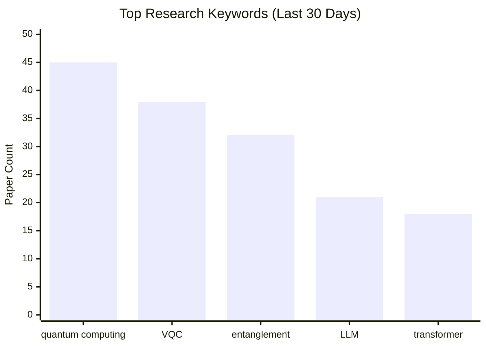

<div align="center">

# 🔬 ArXiv Daily Researcher

**基于 LLM 的智能学术论文监控、筛选与分析系统**

[](https://www.gnu.org/licenses/agpl-3.0)
[](https://www.python.org/downloads/)
[](https://www.docker.com/)
[](https://github.com/features/actions)

*每天早上打开通知，高质量论文摘要已经为你准备好。*

</div>

---

自动从 **ArXiv** 与 **20+ 顶级学术期刊**获取最新论文，通过可配置的关键词权重评分系统精准筛选相关论文，下载 PDF 进行深度分析，追踪关键词演变趋势，生成专业报告，并推送多渠道通知——**全程自动化，零人工干预**。

## 📑 目录

- [✨ 核心功能](#-核心功能)
- [🔄 系统工作流](#-系统工作流)
- [🚀 快速开始](#-快速开始)
- [🐳 Docker 部署](#-docker-部署)
- [☁️ GitHub Actions 云端运行](#️-github-actions-云端运行)
- [🔔 通知配置](#-通知配置)
- [📖 功能详解](#-功能详解)
  - [📡 多数据源抓取](#-多数据源抓取)
  - [🎯 智能评分系统](#-智能评分系统)
  - [🔍 深度 PDF 分析](#-深度-pdf-分析)
  - [📈 关键词趋势追踪](#-关键词趋势追踪)
  - [📄 报告生成](#-报告生成)
  - [⚡ 并发与性能](#-并发与性能)
- [📁 项目结构](#-项目结构)
- [⚙️ 高级配置](#️-高级配置)
- [💰 Token 消耗估算](#-token-消耗估算)
- [❓ 常见问题](#-常见问题)
- [📜 许可证](#-许可证)
- [📝 更新日志](#-更新日志)
- [🤝 API 使用说明](#-api-使用说明)
- [🙏 致谢](#-致谢)

---

## ✨ 核心功能

<table>
<tr>
<td width="50%">

### 📡 多数据源支持
从 ArXiv 预印本和 20+ 顶级期刊（PRL、Nature、Science 等）同步抓取。期刊论文自动检测 ArXiv 版本并切换来源，规避版权限制，获取完整摘要与可下载 PDF。

</td>
<td width="50%">

### 🎯 双 LLM 加权评分
低成本 LLM 对每个关键词独立评分（0–10），乘权重求和后与动态及格线比较。支持从参考 PDF 自动提取关键词并自动分配层级权重。

</td>
</tr>
<tr>
<td width="50%">

### 🔍 深度 PDF 分析
通过筛选的论文自动下载 PDF，使用高性能 LLM 提取研究方法、创新点、技术栈、局限性等七个维度。支持 **MinerU 云端**与 **PyMuPDF 本地**双模式，可自动降级。

</td>
<td width="50%">

### 📈 关键词趋势追踪
将每篇论文关键词写入 SQLite，通过 AI 批量语义归并（如"QC"→"Quantum Computing"），生成 Mermaid 柱状图和折线趋势图，按频率输出趋势报告。

</td>
</tr>
<tr>
<td width="50%">

### 📄 Markdown + HTML 双格式报告
按数据源分目录输出，包含评分详情、摘要翻译、深度分析、趋势图表。HTML 报告卡片式响应式布局，样式通过外置 CSS 变量完全可自定义。

</td>
<td width="50%">

### 🔔 多渠道通知推送
运行完成后自动发送含 Top-N 高分论文的结果通知，支持 **邮件**、**企业微信**、**钉钉**、**Telegram**、**Slack** 和自定义 Webhook，成功/失败分别可配。通知使用**可自定义 Markdown 模板**，错误（MinerU 过期、LLM 异常等）实时告警。

</td>
</tr>
<tr>
<td width="50%">

### 🚀 三种部署方式
**本地脚本 + Cron**、**Docker 容器**（内置定时任务，512 MB 即可运行）、**GitHub Actions**（无需服务器，报告自动保存为 Artifact）。

</td>
<td width="50%">

### 🛡️ 生产级可靠性
全链路指数退避重试、MinerU 智能降级、翻译 MD5 缓存去重、线程安全并发、日志轮转、GitHub 自动更新——开箱即可长期无人值守运行。

</td>
</tr>
</table>

---

## 🔄 系统工作流

每次运行按以下顺序执行完整分析管道：

```
┌─────────────────────────────────────────────────────────────────┐
│                     ArXiv Daily Researcher                      │
├─────────────────────────────────────────────────────────────────┤
│  1. 🔄 自动更新检查  ──  git fetch + pull（可关闭）              │
│  2. 🔑 准备关键词    ──  主关键词 + 参考 PDF 自动提取关键词       │
│  3. 📡 多源抓取论文  ──  ArXiv + 各期刊 API，跳过历史已处理记录   │
│  4. 🎯 基础评分筛选  ──  CHEAP_LLM 逐关键词评分，计算动态及格线  │
│  5. 🔍 深度 PDF 分析 ──  SMART_LLM 分析通过评分论文的 PDF 全文   │
│  6. 💾 关键词记录    ──  提取关键词写入 SQLite，按频率统计        │
│  7. 🤖 AI 标准化     ──  批量归并相似关键词，消除统计碎片化       │
│  8. 📄 生成报告      ──  按来源输出 Markdown / HTML + 趋势图     │
│  9. 🔔 发送通知      ──  Top-N 高分论文推送到配置的通知渠道       │
└─────────────────────────────────────────────────────────────────┘
```

---

## 🚀 快速开始

### 第一步：克隆与安装

```bash
git clone https://github.com/yzr278892/arxiv-daily-researcher.git
cd arxiv-daily-researcher

python -m venv venv
source venv/bin/activate        # Windows: venv\Scripts\activate
pip install -r requirements.txt
```

### 第二步：配置 API Key

```bash
cp .env.example .env
```

编辑 `.env`，**任何兼容 OpenAI API 格式的服务**均可使用（DeepSeek、智谱、Ollama 等）：

```env
# 低成本 LLM — 评分、翻译、关键词标准化（如 gpt-4o-mini、deepseek-chat）
CHEAP_LLM__API_KEY=sk-your-key
CHEAP_LLM__BASE_URL=https://api.openai.com/v1
CHEAP_LLM__MODEL_NAME=gpt-4o-mini
CHEAP_LLM__TEMPERATURE=0.3

# 高性能 LLM — 深度 PDF 全文分析（如 gpt-4o、claude-3-opus）
SMART_LLM__API_KEY=sk-your-key
SMART_LLM__BASE_URL=https://api.openai.com/v1
SMART_LLM__MODEL_NAME=gpt-4o
SMART_LLM__TEMPERATURE=0.3
```

> [!TIP]
> 两个 LLM 可以填写相同的 Key 和模型，统一用 `deepseek-chat` 既经济又够用。
> 完整可选项（OpenAlex、Semantic Scholar、MinerU、各通知渠道）见 `.env.example`。

### 第三步：配置研究方向

编辑 `configs/config.json`，填写你的研究关键词和所需数据源：

```jsonc
{
  "search_settings": {
    "search_days": 7,       // 抓取最近 N 天的论文
    "max_results": 100      // 每个数据源最多抓取数量
  },
  "data_sources": {
    "enabled": ["arxiv", "prl"]
  },
  "target_domains": {
    "domains": ["quant-ph", "cs.AI"]   // ArXiv 领域分类
  },
  "keywords": {
    "primary_keywords": {
      "weight": 1.0,
      "keywords": ["quantum computing", "variational quantum circuit"]
    },
    "research_context": "我的研究方向是量子计算和量子机器学习"
  }
}
```

### 第四步：运行

**推荐：使用运行脚本**（自动检测并创建虚拟环境、安装依赖）

```bash
./scripts/run_daily.sh                                               # Linux
./scripts/run_daily_mac.sh                                           # macOS
powershell -ExecutionPolicy Bypass -File scripts\run_daily.ps1       # Windows
```

**或直接运行：**

```bash
python main.py
```

报告输出到 `data/reports/`，日志保存在 `logs/system.log`。

---

## 🐳 Docker 部署

适合长期后台运行，容器内置 cron 定时任务，**三步启动**：

```bash
git clone https://github.com/yzr278892/arxiv-daily-researcher.git
cd arxiv-daily-researcher
cp .env.example .env   # 填入 API Key
docker compose -f docker/docker-compose.yml up -d
```

容器启动后默认每天 **08:00（Asia/Shanghai）** 自动执行。

### 常用命令

```bash
# 查看运行状态
docker compose -f docker/docker-compose.yml ps

# 实时查看日志
docker compose -f docker/docker-compose.yml logs -f

# 立即手动运行一次（不影响定时任务）
docker compose -f docker/docker-compose.yml run --rm -e MODE=run-once arxiv-researcher

# 停止容器
docker compose -f docker/docker-compose.yml down

# 更新代码后重新构建
docker compose -f docker/docker-compose.yml build && docker compose -f docker/docker-compose.yml up -d
```

或使用 `scripts/` 目录下的 Makefile 快捷命令：

```bash
cd scripts
make build       # 构建镜像
make run         # 启动容器（后台）
make stop        # 停止容器
make logs        # 实时查看日志
make run-once    # 立即运行一次
make build-multi # 多架构构建（AMD64 + ARM64）
```

### 容器环境变量

| 变量             | 默认值          | 说明                                 |
| :--------------- | :-------------- | :----------------------------------- |
| `TZ`             | `Asia/Shanghai` | 时区，影响 cron 执行时间             |
| `CRON_SCHEDULE`  | `0 8 * * *`     | Cron 表达式，控制每日执行时间        |
| `RUN_ON_STARTUP` | `false`         | 设为 `true` 则容器启动时立即运行一次 |
| `MODE`           | `cron`          | `cron`=定时模式，`run-once`=单次执行 |

### 资源占用实测

本项目非常轻量，待机时几乎不消耗资源：

| 状态                      | CPU       | 内存峰值    |
| :------------------------ | :-------- | :---------- |
| 待机（等待 cron 触发）    | ~0%       | ~3 MB       |
| 运行中（抓取 + LLM 分析） | <50% 单核 | ~150–200 MB |

> [!NOTE]
> 镜像约 350 MB（压缩后 ~90 MB），兼容 **AMD64 和 ARM64**，可在树莓派、NAS（群晖等）、VPS、WSL 上运行。最低要求：1 核 CPU、512 MB 内存、1 GB 磁盘。

### 使用本地 LLM（Ollama 等）

`docker-compose.yml` 默认使用 `network_mode: host`，容器直接共享宿主机网络，填写 `127.0.0.1` 即可：

```env
CHEAP_LLM__API_KEY=ollama
CHEAP_LLM__BASE_URL=http://127.0.0.1:11434/v1
CHEAP_LLM__MODEL_NAME=qwen2.5:7b
```

---

## ☁️ GitHub Actions 云端运行

无需服务器，利用 GitHub 免费 CI/CD 每日运行，报告保存为 Artifact 可随时下载。

### 配置步骤

1. **Fork** 本项目到你的 GitHub 账号
2. 进入仓库 **Settings → Secrets and variables → Actions**
3. 添加以下 Repository Secrets：

   | Secret 名称                          | 必填  | 说明                 |
   | :----------------------------------- | :---: | :------------------- |
   | `CHEAP_LLM_API_KEY`                  |   ✅   | 低成本 LLM API Key   |
   | `CHEAP_LLM_BASE_URL`                 |   ✅   | 低成本 LLM API 地址  |
   | `CHEAP_LLM_MODEL_NAME`               |   ✅   | 低成本 LLM 模型名    |
   | `SMART_LLM_API_KEY`                  |   ✅   | 高性能 LLM API Key   |
   | `SMART_LLM_BASE_URL`                 |   ✅   | 高性能 LLM API 地址  |
   | `SMART_LLM_MODEL_NAME`               |   ✅   | 高性能 LLM 模型名    |
   | `SMTP_HOST`、`TELEGRAM_BOT_TOKEN` 等 |   ➖   | 通知渠道密钥（可选） |

4. 工作流默认每天 **UTC 00:00（北京时间 08:00）** 运行，也可在 **Actions** 页面手动触发（支持自定义 `search_days`）
5. 报告作为 Artifact 保存 **30 天**，`data/history/` 和关键词数据库通过 Actions Cache 跨次运行持久化

---

## 🔔 通知配置

### 第一步：在 `.env` 中填写渠道密钥

```env
ENABLE_NOTIFICATIONS=true

# 📧 邮件（Gmail / QQ / 163 等 SMTP）
SMTP_HOST=smtp.gmail.com
SMTP_PORT=587
SMTP_USER=your-email@gmail.com
SMTP_PASSWORD=your-app-password
SMTP_TO=recipient@example.com

# 💬 企业微信
WECHAT_WEBHOOK_URL=https://qyapi.weixin.qq.com/cgi-bin/webhook/send?key=xxx

# 📌 钉钉
DINGTALK_WEBHOOK_URL=https://oapi.dingtalk.com/robot/send?access_token=xxx
DINGTALK_SECRET=SEC-xxx          # 可选：HMAC 签名验证

# ✈️ Telegram
TELEGRAM_BOT_TOKEN=123456:ABC-xxx
TELEGRAM_CHAT_ID=your-chat-id

# 🎯 Slack
SLACK_WEBHOOK_URL=https://hooks.slack.com/services/xxx
```

### 第二步：在 `configs/config.json` 中启用

```jsonc
{
  "notifications": {
    "enabled": true,
    "on_success": true,       // 成功时推送
    "on_failure": true,       // 失败时推送
    "top_n": 5,               // 通知中包含的高分论文数量
    "attach_reports": false   // 是否将报告文件作为邮件附件
  }
}
```

> [!TIP]
> 只需在 `.env` 中填写哪些渠道的密钥，系统便自动启用对应渠道，未配置的渠道静默跳过。
> 通知内容包含运行摘要（总数/通过数/报告路径）及 Top-N 高分论文的标题、得分、TLDR 和原文链接。
> 通知使用 Markdown 模板渲染，企业微信等平台支持富文本展示。

### 第三步：自定义通知模板（可选）

通知消息通过 `configs/notification_templates/` 目录下的 Markdown 模板渲染，开箱即用，也可自行修改：

| 模板文件            | 用途                     | 触发条件                           |
| :------------------ | :----------------------- | :--------------------------------- |
| `success.md`        | 运行成功通知             | 每次成功运行后                     |
| `failure.md`        | 运行失败通知             | 主流程异常退出                     |
| `error_mineru.md`   | MinerU API 错误告警      | Token 过期、额度耗尽、网络异常     |
| `error_llm.md`      | LLM API 错误告警         | API Key 失效、余额不足等           |
| `error_network.md`  | 外部服务连接错误告警     | ArXiv/OpenAlex 等服务连接失败      |
| `error_generic.md`  | 通用错误告警             | 其他未分类的运行时错误             |

模板中以 `# ` 开头的行为注释（不会发送），使用 `{变量名}` 引用动态数据。每个模板文件顶部有完整的可用变量列表和说明。

---

## 📖 功能详解

### 📡 多数据源抓取

**ArXiv 预印本**

通过官方 `arxiv` Python 库抓取，支持全部 ArXiv 领域分类（`quant-ph`、`cs.AI`、`physics.*` 等）。内置 6 秒请求延迟避免触发速率限制，失败时指数退避重试。

**学术期刊（OpenAlex API）**

通过 OpenAlex 开放学术图谱 API 检索 20+ 学术期刊的最新论文（完整列表见[支持的数据源](#支持的数据源列表)）。

**🔀 ArXiv 优先策略**

期刊论文往往在发表前先上传 ArXiv。系统检测到期刊论文存在 ArXiv 版本时，自动切换到 ArXiv API 获取完整元数据（完整摘要 + 可下载 PDF），规避期刊版权限制。此行为在日志中标记为 `检测到 arXiv 版本`。

**Semantic Scholar TLDR 增强**

可选接入 Semantic Scholar API，为每篇论文附加 AI 生成的单句摘要（TLDR），出现在报告和通知消息中。

**去重与历史追踪**

每个数据源维护独立的已处理记录文件（`data/history/`），同一篇论文跨次运行不会被重复处理。

---

### 🎯 智能评分系统

系统使用**双层关键词结构**和**动态及格线**对每篇论文评分：

**关键词层级**

| 类型             | 来源              | 权重配置             |
| :--------------- | :---------------- | :------------------- |
| 主关键词         | 用户手动配置      | 统一权重（如 1.0）   |
| 参考关键词（高） | 参考 PDF 自动提取 | weight: 1.0，前 3 个 |
| 参考关键词（中） | 参考 PDF 自动提取 | weight: 0.2，次 5 个 |
| 参考关键词（低） | 参考 PDF 自动提取 | weight: 0.1，末 2 个 |

**评分公式**

```
论文得分   = Σ (关键词相关度[0–10] × 该关键词权重)  +  作者加分
动态及格线 = base_score + weight_coefficient × Σ(所有关键词权重之和)
```

> [!NOTE]
> 及格线随关键词总权重**动态调整**。例如：配置 3 个权重 1.0 的主关键词时，及格线 = 5.0 + 3.0 × 3 = **14.0**；
> 即便某论文某关键词得满分（10 分），如果其他关键词得分低，总分仍可能不通过。
>
> 未通过及格线的论文仍会出现在报告中（设 `include_all_in_report: true`），但不进入深度分析阶段。

---

### 🔍 深度 PDF 分析

通过评分筛选的论文进入深度分析流程：

1. **下载 PDF 原文**（带指数退避重试）
2. **解析 PDF**（根据配置选择方式）：
   - 🌐 **MinerU 云端解析**（默认）：提交任务、轮询结果，返回结构化 Markdown
   - 💻 **PyMuPDF 本地解析**：提取前 15,000 字符文本
3. **SMART_LLM 深度分析**，提取以下七个维度：

   | 维度       | 说明                       |
   | :--------- | :------------------------- |
   | 🧪 研究方法 | 技术路线与实验设计         |
   | 💡 主要创新 | 区别于现有工作的核心贡献   |
   | 🛠️ 技术栈   | 使用的工具、框架、数据集   |
   | 📊 关键结论 | 主要实验数据与发现         |
   | ⚠️ 局限性   | 作者承认的不足与适用范围   |
   | 🔗 研究关联 | 与用户研究方向的具体相关性 |
   | 🔮 未来方向 | 论文提及或可延伸的后续工作 |

**⚡ MinerU 智能降级机制**

```
MinerU 可用?
  ├─ ✅ 是 → 云端高质量解析
  └─ ❌ 否（Token过期 / 额度耗尽 / 网络异常）
       └─ 自动降级 → PyMuPDF 本地解析
          同一次运行中后续所有论文直接使用 PyMuPDF，避免重复失败
```

**摘要中文翻译**

所有论文摘要通过 CHEAP_LLM 翻译为中文，基于摘要文本的 **MD5 哈希缓存**，同一摘要跨来源只翻译一次（期刊论文与其 ArXiv 版本共享缓存）。

---

### 📈 关键词趋势追踪

系统将每篇论文评分阶段提取到的关键词记录到本地 SQLite 数据库（`data/keywords/keywords.db`）：

**🤖 AI 批量标准化**

使用 CHEAP_LLM 对新出现的关键词进行批量语义归并（如将 `"QC"`、`"quantum circuit"`、`"量子电路"` 统一为 `"Quantum Circuit"`），每批处理 25 个，输出置信度分数，消除统计碎片化。

**📊 Mermaid 可视化图表**



- **柱状图**：最近 N 天出现频率最高的 Top-15 关键词
- **趋势折线图**：Top-5 关键词随时间变化的周期演变

**趋势报告生成频率**：`daily` / `weekly` / `monthly` / `always`，按需配置。

---

### 📄 报告生成

**Markdown 报告**

每个数据源生成独立文件，存放在 `data/reports/markdown/[source]/`，文件名格式 `SOURCE_Report_YYYY-MM-DD_HH-MM-SS.md`。使用可折叠 `<details>` 块展示摘要、评分详情、深度分析等长内容，避免视觉干扰。

**HTML 报告**

可选同步输出卡片式响应式 HTML 报告（`data/reports/html/[source]/`），布局现代，支持移动端。样式完全由 `configs/report_templates/html_report.css` 控制，修改 CSS 变量即可调整配色——无需改动任何 Python 代码。

**模板驱动渲染**

报告各部分（基础信息、评分详情、TLDR、摘要翻译、深度分析）由独立渲染模块通过 JSON 模板配置驱动，可自由开启/关闭、调整折叠默认状态、切换格式。

---

### ⚡ 并发与性能

**多线程并发**（默认关闭）

启用后，评分和深度分析阶段使用 `ThreadPoolExecutor` 并行处理多篇论文，处理速度可提升 **5–10×**。翻译缓存、历史记录写入均通过 `threading.Lock` 保护，线程安全。

> [!WARNING]
> 并发线程数建议不超过 5，线程过多容易触发 LLM API 速率限制（429 错误）。

**自动重试（指数退避）**：覆盖全链路 — LLM 评分/翻译/深度分析、PDF 下载、OpenAlex API、Semantic Scholar API。

---

## 📁 项目结构

```
arxiv-daily-researcher/
├── 📄 main.py                      # 主程序入口
├── 🔑 .env                         # API Keys（用户创建，不入 git）
├── 📋 .env.example                  # 环境变量模板
├── 📦 requirements.txt             # Python 依赖
│
├── 📂 src/                         # 源代码
│   ├── ⚙️  config.py               # 全局配置管理（Pydantic）
│   └── 🤖 agents/
│       ├── search_agent.py         # 多源论文抓取编排
│       ├── analysis_agent.py       # LLM 评分 + 深度分析
│       ├── keyword_agent.py        # 从参考 PDF 提取关键词
│       ├── reporter.py             # Markdown / HTML 报告生成
│       ├── notifier.py             # 多渠道通知推送
│       ├── mineru_parser.py        # MinerU 云端 PDF 解析
│       ├── 📂 keyword_tracker/     # 关键词趋势追踪子系统
│       │   ├── database.py         # SQLite 操作
│       │   ├── tracker.py          # 追踪器入口
│       │   ├── normalizer.py       # AI 关键词标准化
│       │   └── mermaid_generator.py
│       ├── 📂 report_modules/      # 模块化报告渲染器
│       └── 📂 sources/             # 数据源适配器
│           ├── base_source.py      # 抽象基类 + PaperMetadata
│           ├── arxiv_source.py
│           ├── openalex_source.py
│           └── semantic_scholar_enricher.py
│
├── ⚙️  configs/
│   ├── config.json                 # 项目主配置（JSON5，可写注释）
│   ├── 📂 notification_templates/  # 通知消息模板（可自定义）
│   │   ├── success.md              # 运行成功通知模板
│   │   ├── failure.md              # 运行失败通知模板
│   │   ├── error_mineru.md         # MinerU 错误告警模板
│   │   ├── error_llm.md            # LLM API 错误告警模板
│   │   ├── error_network.md        # 网络错误告警模板
│   │   └── error_generic.md        # 通用错误告警模板
│   └── 📂 report_templates/
│       ├── basic_report_template.json
│       ├── deep_analysis_template.json
│       └── html_report.css         # HTML 报告样式（可自定义）
│
├── 🖥️  scripts/
│   ├── run_daily.sh                # Linux 本地运行脚本
│   ├── run_daily_mac.sh            # macOS 本地运行脚本
│   ├── run_daily.ps1               # Windows PowerShell 脚本
│   └── Makefile                    # Docker 快捷命令
│
├── 🐳 docker/
│   ├── Dockerfile
│   ├── docker-compose.yml
│   └── entrypoint.sh
│
├── ☁️  .github/workflows/
│   └── daily-run.yml               # GitHub Actions 定时工作流
│
└── 📊 data/                        # 运行数据（自动创建）
    ├── reports/markdown/[source]/
    ├── reports/html/[source]/
    ├── keywords/keywords.db
    ├── keywords/keywords_cache.json
    ├── history/                    # 各数据源已处理记录
    ├── reference_pdfs/             # 放入你的参考论文 PDF
    └── downloaded_pdfs/            # 临时下载的 PDF
```

---

## ⚙️ 高级配置

### 支持的数据源列表

| 配置代码                                     | 期刊 / 来源                                     |
| :------------------------------------------- | :---------------------------------------------- |
| `arxiv`                                      | ArXiv 预印本（全领域）                          |
| `prl`                                        | Physical Review Letters                         |
| `pra` / `prb` / `prc` / `prd` / `pre`        | Physical Review A / B / C / D / E               |
| `prx` / `prxq`                               | Physical Review X / PRX Quantum                 |
| `rmp`                                        | Reviews of Modern Physics                       |
| `nature` / `nature_physics` / `nature_comms` | Nature / Nature Physics / Nature Communications |
| `science` / `science_advances`               | Science / Science Advances                      |
| `npj_quantum`                                | npj Quantum Information                         |
| `quantum`                                    | Quantum (open-access)                           |
| `njp`                                        | New Journal of Physics                          |

> [!NOTE]
> 完整 ISSN 映射见 `src/agents/sources/openalex_source.py`。
> 如需添加新期刊，请参考[常见问题 · 如何添加未列出的学术期刊](#-如何添加当前列表中没有的学术期刊)。

---

### 关键词配置

**主关键词**

```jsonc
{
  "keywords": {
    "primary_keywords": {
      "weight": 1.0,
      "keywords": ["quantum error correction", "surface code", "fault-tolerant"]
    },
    "research_context": "我的研究方向是容错量子计算与量子纠错码"
  }
}
```

**从参考文献自动提取关键词**

将最相关的论文 PDF 放入 `data/reference_pdfs/`，开启自动提取：

```jsonc
{
  "keywords": {
    "enable_reference_extraction": true,
    "reference_keywords_config": {
      "max_keywords": 10,
      "similarity_threshold": 0.75,
      "weight_distribution": {
        "high_importance":   { "weight": 1.0, "count": 3 },
        "medium_importance": { "weight": 0.2, "count": 5 },
        "low_importance":    { "weight": 0.1, "count": 2 }
      }
    }
  }
}
```

系统通过 PDF 文件哈希检测变化，仅对新增或修改的文件重新提取，结果缓存至 `data/keywords/keywords_cache.json`。

**按数据源单独配置抓取数量**

```jsonc
{
  "search_settings": {
    "max_results": 100,
    "max_results_per_source": { "arxiv": 150, "prl": 50 }
  }
}
```

---

### 评分公式调优

```jsonc
{
  "scoring_settings": {
    "keyword_relevance_score": { "max_score_per_keyword": 10 },
    "author_bonus": {
      "enabled": false,
      "expert_authors": ["Preskill, J.", "Fowler, A."],
      "bonus_points": 5.0
    },
    "passing_score_formula": {
      "base_score": 5.0,          // 及格线基础分
      "weight_coefficient": 3.0   // 及格线 = base + 3.0 × Σ(权重)
    },
    "include_all_in_report": true
  }
}
```

---

### PDF 解析模式

```jsonc
{
  "pdf_parser": {
    "mode": "mineru",                      // "mineru" 或 "pymupdf"
    "mineru_model_version": "pipeline",    // "pipeline"（快速）或 "vlm"（更精确）
    "poll_interval": 3,                    // 轮询任务状态间隔（秒）
    "poll_timeout": 300                    // 单任务最长等待（秒）
  }
}
```

| 模式      | 优势                         | 限制                           |
| :-------- | :--------------------------- | :----------------------------- |
| `mineru`  | 解析质量高，支持复杂公式排版 | 需 API Token，每日 2000 页额度 |
| `pymupdf` | 无需网络，无额度限制，即时   | 质量受 PDF 来源影响            |

**MinerU 申请步骤：**
1. 到 [MinerU 官网](https://mineru.net/apiManage/apiKey) 申请 API Token（有效期 3 个月）
2. 在 `.env` 中配置：`MINERU_API_KEY=your-token`
3. 确认 `pdf_parser.mode` 为 `"mineru"`（已是默认值）

> [!IMPORTANT]
> MinerU Token 有效期为 **3 个月**，过期后系统会在日志中提示并自动降级。
> 每日享有 **2000 页**最高优先级解析额度，超出后优先级自动降低（不会中断运行）。

---

### 关键词趋势配置

```jsonc
{
  "keyword_tracker": {
    "enabled": true,
    "normalization": { "enabled": true, "batch_size": 25 },
    "trend_view": { "default_days": 30 },
    "charts": {
      "bar_chart":   { "top_n": 15 },
      "trend_chart": { "top_n": 5 }
    },
    "report": {
      "enabled": true,
      "frequency": "weekly"   // "daily" | "weekly" | "monthly" | "always"
    }
  }
}
```

---

### 并发与重试

```jsonc
{
  "concurrency": { "enabled": false, "workers": 3 },
  "retry": { "max_attempts": 3, "min_wait": 2, "max_wait": 30 }
}
```

---

### 日志管理

```jsonc
{
  "logging": {
    "rotation_type": "time",   // "time"=按天轮转，"size"=按 5 MB 轮转
    "keep_days": 30
  }
}
```

---

### HTML 报告自定义

修改 `configs/report_templates/html_report.css` 中的 CSS 变量即可调整整体风格：

```css
:root {
    --color-primary: #2563eb;  /* 主色调 */
    --color-pass:    #16a34a;  /* 通过标记颜色 */
    --color-fail:    #dc2626;  /* 未通过标记颜色 */
    --color-bg:      #f0f2f5;  /* 页面背景色 */
}
```

开启 HTML 报告：`"report_settings": { "enable_html_report": true }`

---

### 自动更新

```jsonc
{ "auto_update": { "enabled": true } }
```

每次运行前 `git fetch` 检测更新 → `git stash` 暂存本地改动 → `git pull` → `git stash pop` 恢复。网络超时不阻塞主流程。

---

## 💰 Token 消耗估算

| 阶段     | 输入 Token | 输出 Token | 说明                             |
| :------- | :--------: | :--------: | :------------------------------- |
| 基础评分 |    ~800    |    ~300    | 标题 + 摘要 + 评分 Prompt        |
| 摘要翻译 |    ~400    |    ~200    | MD5 缓存去重，同摘要只翻译一次   |
| 深度分析 |   ~8,000   |   ~1,500   | PDF 前 15,000 字符 + 分析 Prompt |

**示例：** 处理 100 篇论文，15 篇进入深度分析

| 阶段     | 计算                   |  Token 小计  |
| :------- | :--------------------- | :----------: |
| 基础评分 | 100 × (800 + 300)      |   ~110,000   |
| 摘要翻译 | ~80 篇（去重后） × 600 |   ~48,000    |
| 深度分析 | 15 × (8,000 + 1,500)   |   ~142,500   |
| **合计** |                        | **~300,500** |

> [!TIP]
> 使用 DeepSeek、Kimi 等低价 API，每日运行费用通常在 **¥0.1–¥0.5** 之间。

---

## ❓ 常见问题

<details>
<summary><b>🐳 Docker 内无法访问宿主机上的本地 LLM API（连接拒绝）？</b></summary>

`docker-compose.yml` 已配置 `network_mode: host`，容器直接共享宿主机网络栈。在 `.env` 中填写 `127.0.0.1` 即可直接访问 Ollama 等本地服务，无需额外配置。

```env
CHEAP_LLM__BASE_URL=http://127.0.0.1:11434/v1
```

</details>

<details>
<summary><b>⚠️ 遇到 429 Rate Limit 错误？</b></summary>

1. 系统已为所有请求配置自动重试（指数退避），大多数临时限速会自动恢复
2. ArXiv 官方库内置 6 秒延迟
3. 在 `.env` 中配置 `OPENALEX_EMAIL`，进入 OpenAlex 礼貌池，可显著提升速率上限
4. 减小 `search_settings.max_results`
5. 仍频繁触发时，可减少 `concurrency.workers` 或增大 `retry.max_wait`

</details>

<details>
<summary><b>⏰ 如何定时自动运行？</b></summary>

三种方式任选其一：

**Docker（推荐）**
```bash
docker compose -f docker/docker-compose.yml up -d
# 修改 CRON_SCHEDULE 环境变量调整执行时间（默认每天 08:00）
```

**GitHub Actions（无需服务器）**

Fork 项目并配置 Secrets，自动每天运行，详见 [☁️ GitHub Actions 云端运行](#️-github-actions-云端运行)。

**系统 Cron（Linux/macOS）**
```bash
crontab -e
0 8 * * * cd /path/to/arxiv-daily-researcher && ./scripts/run_daily.sh >> /tmp/arxiv-cron.log 2>&1
```

</details>

<details>
<summary><b>🎯 如何调整评分松紧，让更多 / 更少论文通过筛选？</b></summary>

及格线公式为 `base_score + weight_coefficient × Σ(权重之和)`：

- **更宽松**：减小 `base_score`（如 5.0 → 3.0）或 `weight_coefficient`（如 3.0 → 2.0）
- **更严格**：增大上述参数，或增加更多高权重关键词
- **调试**：日志中有每篇论文各关键词的具体得分明细，可据此调整

> [!TIP]
> 先设 `include_all_in_report: true`（默认已开启）观察得分分布，再调整参数，比盲目修改更有效率。

</details>

<details>
<summary><b>📎 从参考文献提取的关键词不够精准？</b></summary>

参考 PDF 的质量直接影响提取效果：

- **使用文本型 PDF**（非扫描版），确保 PyMuPDF 能提取可读文本
- **选择领域核心综述论文**，而非边缘文献——关键词越集中，提取越准确
- 调整 `similarity_threshold`（默认 0.75）控制去重粒度：值越小越严格去重
- 提取缓存基于 **PDF 文件哈希**，更换 PDF 内容后自动触发重新提取，无需手动清理缓存

</details>

<details>
<summary><b>📰 为什么某些期刊论文没有摘要或内容不完整？</b></summary>

期刊论文的完整摘要通常受版权保护，OpenAlex 元数据中可能不含摘要正文。

系统的 **ArXiv 优先策略**会自动检测期刊论文是否有 ArXiv 预印本版本，有则切换到 ArXiv 获取完整摘要和 PDF。

对于**没有 ArXiv 版本且 OpenAlex 无摘要**的论文，系统会以标题和可用元数据进行评分（得分通常较低），深度分析也将退回到摘要模式（若 PDF 也无法下载）。这类情况属于数据源限制，暂无法完全规避。

</details>

<details>
<summary><b>📥 深度分析时 PDF 下载失败，被回退到摘要分析模式？</b></summary>

PDF 下载失败（超时、403、链接失效等）时，`deep_analyze()` 会以 `fallback_to_abstract=True` 模式仅用摘要文本分析，报告中会注明。常见原因：

- 论文无 ArXiv 版本，期刊 PDF 需会员权限（常见于 PRL、Nature 等）
- 网络超时（可增大 `retry.max_wait` 延长等待时间）
- ArXiv PDF 服务器临时不可用（重试通常能解决）

</details>

<details>
<summary><b>🌐 MinerU 解析失败，如何排查？</b></summary>

查看 `logs/system.log`，MinerU 模块记录详细错误信息：

| 错误类型   | 日志提示              | 处理建议                                 |
| :--------- | :-------------------- | :--------------------------------------- |
| Token 过期 | `MinerU Token 已过期` | 重新申请 Token 并更新 `.env`             |
| 额度耗尽   | `每日解析额度已耗尽`  | 等待次日重置，临时切换 `mode: "pymupdf"` |
| 任务超时   | `轮询超时`            | 增大 `poll_timeout`，或切换到 pymupdf    |
| 网络异常   | `MinerU API 请求失败` | 当次运行自动降级，检查网络               |

> [!NOTE]
> 遇到不可恢复错误时，系统自动降级到 PyMuPDF，**同一运行中后续所有论文不再重试 MinerU**，避免重复失败。

</details>

<details>
<summary><b>🗑️ 如何重置历史记录，重新处理所有论文？</b></summary>

历史记录存储在 `data/history/` 目录下，每个数据源对应一个 `.jsonl` 文件。

```bash
# 重置单个数据源（如 arxiv）
rm data/history/arxiv_processed.jsonl

# 重置所有数据源
rm -rf data/history/
```

下次运行时，系统将视所有论文为新论文重新处理。

> [!CAUTION]
> 重置后，已分析过的论文会被重新下载和分析，会产生额外的 LLM API 费用。

</details>

<details>
<summary><b>📚 如何添加当前列表中没有的学术期刊？</b></summary>

编辑 `src/agents/sources/openalex_source.py`，在 `JOURNAL_ISSN_MAP` 中添加新条目：

```python
JOURNAL_ISSN_MAP = {
    # ... 已有期刊 ...
    "your_journal_code": {
        "issn": ["1234-5678"],           # 从 OpenAlex 或期刊官网查询
        "display_name": "Journal Name",
    },
}
```

然后在 `configs/config.json` 的 `data_sources.enabled` 中加入该代码即可。ISSN 可在 [OpenAlex](https://openalex.org/) 搜索期刊名称获取。

</details>

<details>
<summary><b>🤖 如何选择 CHEAP_LLM 和 SMART_LLM 的模型？</b></summary>

| 角色        | 调用场景                             | 推荐选择                                             |
| :---------- | :----------------------------------- | :--------------------------------------------------- |
| `CHEAP_LLM` | 每篇论文均调用（评分、翻译、标准化） | DeepSeek-chat、GLM-4-Flash、GPT-4o-mini — 低成本优先 |
| `SMART_LLM` | 仅高分论文调用（深度 PDF 分析）      | GPT-4o、Claude-3-Opus、DeepSeek-chat — 质量优先      |

> [!TIP]
> 两者完全可以使用**同一个模型**（如统一配置 `deepseek-chat`），兼顾经济性与质量。
> 本地 Ollama 模型（如 `qwen2.5:7b`）也可正常运行，适合完全离线场景，但复杂推理能力相对有限。

</details>

<details>
<summary><b>🔀 关键词标准化后，关键词消失了或被错误合并？</b></summary>

AI 标准化偶尔可能出现过度归并。处理方式：

1. **完全禁用**：设 `normalization.enabled: false`
2. **减小批量**：将 `batch_size` 从 25 改为 10，每批更少关键词，LLM 判断更精准
3. **直接检查数据**：用任意 SQLite 浏览器（如 DB Browser for SQLite）查看 `data/keywords/keywords.db` 中的归并情况

</details>

<details>
<summary><b>🔎 如何查看每次运行的详细过程和调试信息？</b></summary>

日志文件位于 `logs/system.log`，记录完整执行链路：

- 每篇论文各关键词得分明细
- 翻译缓存命中与节省统计
- PDF 下载及 MinerU 任务进度
- 关键词提取与标准化结果
- 通知发送成功/失败状态

如需更详细的调试信息，可临时修改 `src/utils/logger.py`，将 `INFO` 改为 `DEBUG`。

</details>

---

## 📜 许可证

本项目采用 [AGPL-3.0](https://www.gnu.org/licenses/agpl-3.0.html) 许可证。

| 权限       | 说明                                       |
| :--------- | :----------------------------------------- |
| ✅ 使用     | 可自由使用、修改、分发                     |
| ✅ 商用     | 允许商业使用                               |
| 📋 源码公开 | 修改后的版本须公开源代码并使用相同许可证   |
| 🌐 网络使用 | 通过网络提供服务时也须公开源代码           |
| 📝 声明     | 需保留原始版权声明和许可证                 |

---

## 📝 更新日志

### ✅ v2.1 — 2026-03-03

**📋 许可证变更（1 项）**

1. **许可证从 CC BY-NC-SA 4.0 变更为 AGPL-3.0** — 更适合开源软件项目的许可协议，允许商业使用，要求衍生作品公开源代码

**✨ 新功能（2 项）**

2. **通知消息 Markdown 模板系统** — 通知消息改用可自定义的 Markdown 模板渲染，适配企业微信等支持 Markdown 的平台。模板文件存放于 `configs/notification_templates/`，包含运行成功（`success.md`）、运行失败（`failure.md`）及多种错误告警模板，用户可直接修改模板自定义通知样式和内容
3. **运行时错误实时告警通知** — 新增错误告警通知机制，当 MinerU API Token 过期、额度耗尽、LLM API 异常、网络连接失败等错误发生时，立即通过配置的通知渠道推送告警，包含错误详情和处理建议（模板文件：`error_mineru.md`、`error_llm.md`、`error_network.md`、`error_generic.md`）

**🗑️ 清理（1 项）**

4. **移除临时文档** — 删除不再需要的 `mineruapi.md` 文件

---

### ✅ v2.0 — 2026-03-03

<details>
<summary><b>📦 项目结构重构（5 项）</b></summary>

1. **源代码目录化** — 所有 Python 源代码迁入 `src/` 目录（`config.py`、`agents/`、`utils/`），`main.py` 保留在根目录
2. **配置文件集中管理** — 新增 `configs/` 目录，`search_config.json` 重命名为 `configs/config.json`，`report_templates/` 迁入 `configs/`
3. **运行脚本集中管理** — `run_daily.sh`、`run_daily_mac.sh`、`run_daily.ps1` 和 `Makefile` 统一迁入 `scripts/`
4. **Docker 文件集中管理** — `Dockerfile`、`docker-compose.yml` 迁入 `docker/` 目录，构建上下文指向项目根目录
5. **精简 `.gitignore` / `.dockerignore`** — 移除大量冗余规则，只保留项目实际需要的条目

</details>

<details>
<summary><b>✨ 新功能（15 项）</b></summary>

6. **自动更新检查** — 每次运行前自动从 GitHub 拉取最新代码，支持本地修改暂存/恢复，网络异常不阻塞（新增 `src/utils/updater.py`）
7. **Docker 一键部署** — 新增 `Dockerfile`、`docker-compose.yml` 和容器入口脚本，支持 `MODE=run-once`、`RUN_ON_STARTUP`，多架构构建（AMD64 + ARM64）
8. **多渠道通知系统** — 支持邮件、企业微信、钉钉（含 HMAC 签名）、Telegram、Slack、通用 Webhook，通知包含 Top-N 高分论文，成功/失败可分别配置
9. **GitHub Actions 定时工作流** — 每天 UTC 00:00 触发，支持手动触发，API Key 通过 Secrets 管理，报告作为 Artifact 保存 30 天
10. **自动重试机制** — 基于 tenacity 的指数退避重试，覆盖 LLM 调用、PDF 下载、OpenAlex / Semantic Scholar API
11. **并发处理** — 可选多线程加速评分和深度分析，`ThreadPoolExecutor` 实现，翻译缓存和历史记录均线程安全
12. **HTML 报告生成** — 可选同步输出 HTML 报告，卡片式响应式布局，深度分析可折叠，统计栏含通过率
13. **MinerU 云端 PDF 解析** — 新增 MinerU API 作为默认解析方式，支持 `pipeline`/`vlm` 两种模型，自动检测 Token 过期和额度耗尽，不可用时智能降级（新增 `src/agents/mineru_parser.py`）
14. **HTML 报告 CSS 外置** — 样式从 `configs/report_templates/html_report.css` 加载，通过 CSS 变量控制主题色，修改即生效
15. **报告目录结构优化** — Markdown 和 HTML 报告分离存放至 `data/reports/markdown/[source]/` 和 `data/reports/html/[source]/`
16. **关键词数据目录整理** — `keywords.db` 和 `keywords_cache.json` 统一迁入 `data/keywords/` 子目录
17. **日志轮转管理** — 按天或按大小（5 MB）两种轮转模式，可配置保留天数；Docker 容器额外自动清理过期 cron/startup 日志
18. **按数据源单独配置搜索数量** — 新增 `max_results_per_source`，未配置者回退到全局默认值
19. **Makefile 便捷命令** — `make run` / `make run-once` / `make logs` / `make build-multi` 等 Docker 快捷操作
20. **VSCode 工作区配置** — 新增 `.vscode/extensions.json`（推荐插件）和 `.vscode/settings.json`（自动指向 venv、Black 格式化、Flake8 检查）

</details>

<details>
<summary><b>🐛 Bug 修复（2 项）</b></summary>

21. **修复翻译缓存节省统计逻辑反转** — `cache_savings` 计算公式错误，导致日志中节省提示永远不打印（`main.py`）
22. **修复 Docker 内无法访问宿主机 LLM API** — 使用 `network_mode: host` 替代独立网络，彻底解决容器内 `127.0.0.1` 连接被拒问题

</details>

---

### ✅ v1.3 — 2026-03-01

**🐛 Bug 修复（3 项）**

1. **修复 OpenAlex 数据源每页只处理最后一篇论文的严重 Bug** — `for item in results:` 循环中去重、标题/作者/摘要提取等逻辑缩进错误，导致每页只有最后一篇被处理，大量论文被静默跳过
2. **修复关键词标准化 JSON 解析失败** — LLM 将 JSON 包裹在 Markdown 代码块中返回时直接报错。在 `normalizer.py` 新增 `_extract_json()` 自动剥离代码块；`keyword_agent.py` 同步修复，补充无语言标注代码块的处理
3. **修复关键词标准化 JSON 截断问题** — `batch_size=50` 时 LLM 输出易超 token 上限导致 JSON 不完整。将默认值从 50 改为 25，同步更新四处配置

---

### ✅ v1.2 — 2026-02-08

**🐛 重要修复（1 项）**

1. **修复 OpenAlex 源缩进错误** — 标题、作者、摘要提取代码无法执行（此问题后在 v1.3 中被更全面修复）

**⚡ 性能优化（2 项）**

2. **翻译缓存机制** — 新增 MD5 哈希缓存，同一摘要（ArXiv 与期刊重复时）只翻译一次
3. **KeywordTracker 实例优化** — 移到处理循环外初始化，减少数据库连接开销

**✨ 功能增强（2 项）**

4. **ArXiv 优先策略** — 期刊论文有 ArXiv 版本时自动切换，获取完整元数据
5. **增强 Semantic Scholar 集成** — 改进 ArXiv 版本检测逻辑，同时获取 TLDR

---

### ✅ v1.1 — 2026-02-05

**运行脚本增强（4 项）**

1. 新增虚拟环境自动检测与创建功能
2. 新增 macOS 运行脚本（`run_daily_mac.sh`）
3. 新增 Windows PowerShell 脚本（`run_daily.ps1`）
4. 增强 Linux 运行脚本（`run_daily.sh`）

---

### ✅ v1.0 — 2026-02-06

**首次正式发布（6 项）**

1. 多数据源支持（ArXiv + 20+ 学术期刊，基于 OpenAlex）
2. 智能评分系统（关键词加权 + 动态及格线）
3. 深度 PDF 分析（LLM 驱动，PyMuPDF 本地解析）
4. 关键词趋势追踪（SQLite 存储 + Mermaid 可视化）
5. AI 关键词标准化（批量语义归并）
6. Markdown 报告生成（按数据源分目录）

---

## 🤝 API 使用说明

本项目遵循各 API 提供方的使用规范：

| API                  | 使用规范                                                                |
| :------------------- | :---------------------------------------------------------------------- |
| **ArXiv**            | 使用官方 `arxiv` Python 库，内置 6 秒请求延迟                           |
| **OpenAlex**         | 请求头包含联系方式，建议配置 `OPENALEX_EMAIL` 进入礼貌池（Polite Pool） |
| **Semantic Scholar** | 请求头含 User-Agent，支持配置 API Key 获取更高速率                      |
| **MinerU**           | 遵守每日 2000 页优先级额度限制，超出后自动降至普通优先级                |

---

## 🙏 致谢

- 本项目在 [Claude](https://www.anthropic.com/claude)（Anthropic）的协助下开发，使用 [Claude Code](https://claude.ai/code) 进行代码编写与调试
- 感谢 [ArXiv](https://arxiv.org/)、[OpenAlex](https://openalex.org/)、[Semantic Scholar](https://www.semanticscholar.org/) 提供的开放 API
- 感谢 [MinerU](https://mineru.net/) 提供高质量云端 PDF 解析服务

---

<div align="center">

如果这个项目对你有帮助，欢迎点一个 **Star** ⭐

[提交问题](https://github.com/yzr278892/arxiv-daily-researcher/issues) · [发送邮件](mailto:yzr278892@gmail.com)

</div>
